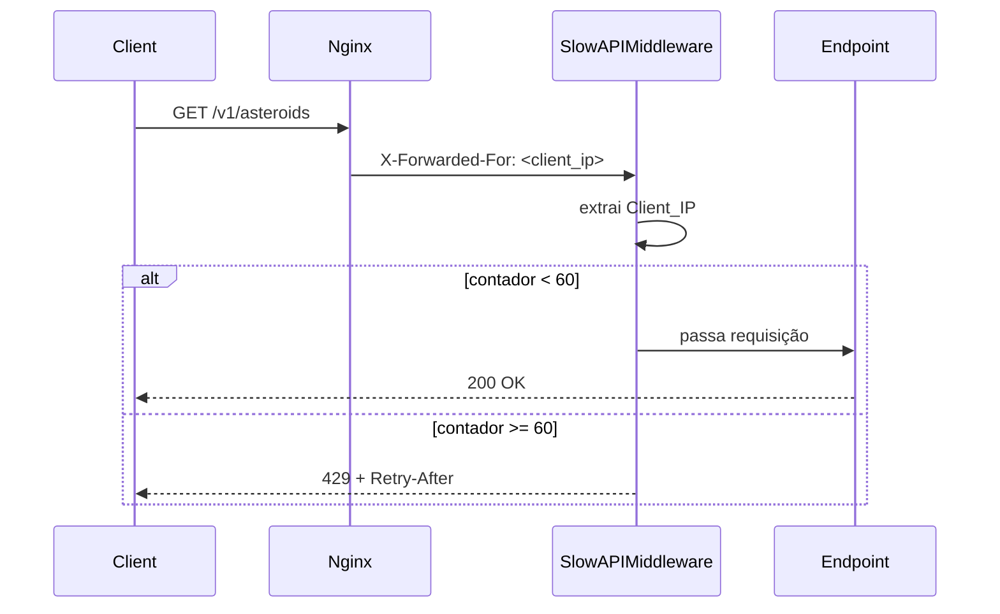

# Design Document: api-rate-limiting

## Overview

A feature adiciona rate limiting por IP à API Astraea usando `slowapi`, uma biblioteca construída sobre `limits` que integra nativamente com FastAPI/Starlette. A solução é inteiramente em memória — sem Redis ou banco externo — e respeita o IP real do cliente extraído do header `X-Forwarded-For` injetado pelo Nginx.

O limite é de **60 requisições por minuto por IP**, aplicado a todos os endpoints sob `/v1/`. Os endpoints `GET /` e `GET /health` ficam fora do rate limiting para não bloquear ferramentas de monitoramento.

Quando o limite é excedido, a API retorna HTTP 429 com corpo JSON `{"error": "Rate limit exceeded: 60 per 1 minute"}` e o header `Retry-After`.

### Decisões de design

- **slowapi em vez de implementação manual**: integração nativa com FastAPI via middleware e decorator, sem reinventar a roda.
- **Decorator por endpoint em vez de middleware global**: permite excluir `/` e `/health` de forma explícita e sem lógica condicional no middleware.
- **Extração de IP via função customizada**: necessária para ler `X-Forwarded-For` e pegar o primeiro IP da cadeia, cobrindo o cenário de múltiplos proxies.
- **Armazenamento em memória**: suficiente para o volume esperado; elimina dependência de infraestrutura externa.

---

## Architecture



```mermaid
graph TD
    A[main.py] -->|instancia| B[Limiter]
    A -->|registra| C[SlowAPIMiddleware]
    A -->|registra| D[exception_handler RateLimitExceeded]
    B -->|app.state.limiter| C
    E[routers/asteroids.py] -->|@limiter.limit| F[endpoints /v1/asteroids*]
    G[routers/solar_events.py] -->|@limiter.limit| H[endpoints /v1/solar-events*]
    I[routers/stats.py] -->|@limiter.limit| J[endpoint /v1/stats/summary]
    K[root / e /health] -->|sem decorator| L[sem rate limit]
```

---

## Components and Interfaces

### `get_client_ip(request: Request) -> str`

Função de extração de IP registrada como `key_func` no `Limiter`. Lógica:

1. Lê `request.headers.get("X-Forwarded-For")`.
2. Se presente, retorna o primeiro IP da lista (split por `,` + strip).
3. Caso contrário, retorna `request.client.host`.

### `Limiter` (slowapi)

```python
from slowapi import Limiter
limiter = Limiter(key_func=get_client_ip)
```

Instanciado em `main.py` e atribuído a `app.state.limiter`.

### `SlowAPIMiddleware`

Registrado via `app.add_middleware(SlowAPIMiddleware)`. Intercepta todas as requisições e delega a contagem ao `Limiter`.

### `_rate_limit_exceeded_handler`

Handler de exceção para `RateLimitExceeded`:

```python
from slowapi.errors import RateLimitExceeded
from fastapi.responses import JSONResponse

async def _rate_limit_exceeded_handler(request, exc):
    return JSONResponse(
        status_code=429,
        content={"error": "Rate limit exceeded: 60 per 1 minute"},
        headers={"Retry-After": str(exc.retry_after)},
    )
```

Registrado via `app.add_exception_handler(RateLimitExceeded, _rate_limit_exceeded_handler)`.

### Decorator nos endpoints `/v1/`

Cada função de endpoint nos três routers recebe:

```python
@limiter.limit("60/minute")
async def endpoint(request: Request, ...):
    ...
```

O parâmetro `request: Request` é obrigatório para o slowapi funcionar.

---

## Data Models

Não há novos modelos de dados. O rate limiting opera exclusivamente sobre metadados HTTP (IP, contadores em memória, headers de resposta).

### Estrutura do contador em memória (slowapi/limits)

O `slowapi` usa a biblioteca `limits` internamente. O storage padrão é `MemoryStorage`, que mantém um dicionário:

```
{ "<key_func_result>:<limit_string>": (count, window_reset_timestamp) }
```

Onde `key_func_result` é o Client_IP retornado por `get_client_ip`.

### Resposta 429

```json
{
  "error": "Rate limit exceeded: 60 per 1 minute"
}
```

Headers adicionais na resposta 429:
- `Retry-After: <segundos>` — número inteiro de segundos até o reset da janela.

---

## Correctness Properties

*A property is a characteristic or behavior that should hold true across all valid executions of a system — essentially, a formal statement about what the system should do. Properties serve as the bridge between human-readable specifications and machine-verifiable correctness guarantees.*

### Property 1: Extração do IP real do X-Forwarded-For

*For any* string de header `X-Forwarded-For` contendo um ou mais IPs separados por vírgula, a função `get_client_ip` deve retornar exatamente o primeiro IP da lista, sem espaços.

**Validates: Requirements 2.2, 2.4, 5.1, 5.2**

### Property 2: Limite de requisições por IP

*For any* endpoint sob `/v1/` e qualquer Client_IP, após exatamente 60 requisições bem-sucedidas dentro da mesma Rate_Limit_Window, a 61ª requisição deve retornar HTTP 429.

**Validates: Requirements 3.1, 3.5, 4.1**

### Property 3: Formato da resposta 429

*For any* resposta HTTP 429 gerada pelo rate limiter, o corpo deve ser JSON com o campo `error` igual a `"Rate limit exceeded: 60 per 1 minute"` e o header `Retry-After` deve estar presente com valor inteiro positivo.

**Validates: Requirements 4.2, 4.3**

### Property 4: Isolamento de contadores por IP

*For any* dois Client_IPs distintos, as requisições de um IP não devem afetar o contador do outro — cada IP mantém sua própria contagem independente dentro da Rate_Limit_Window.

**Validates: Requirements 5.3, 5.4**

---

## Error Handling

| Situação | Comportamento |
|---|---|
| Limite excedido (61ª req) | HTTP 429, JSON `{"error": "Rate limit exceeded: 60 per 1 minute"}`, header `Retry-After` |
| `X-Forwarded-For` ausente | Fallback para `request.client.host`; rate limiting continua funcionando |
| `X-Forwarded-For` com cadeia de proxies | Usa o primeiro IP da lista |
| Requisição para `/` ou `/health` | Processada normalmente, sem rate limiting |
| Erro interno no handler 429 | FastAPI retorna 500 padrão (não esperado em operação normal) |

O handler `_rate_limit_exceeded_handler` é o único ponto de customização da resposta de erro. Ele captura `RateLimitExceeded` do slowapi e produz a resposta padronizada. Não há logging adicional necessário para esta feature.

---

## Testing Strategy

### Abordagem dual

Os testes combinam **exemplos específicos** (para comportamentos determinísticos e estruturais) com **testes de propriedade** (para comportamentos que devem valer para qualquer entrada).

### Testes de exemplo (pytest)

Verificam comportamentos específicos e estruturais:

- `requirements.txt` contém `slowapi==0.1.9`
- `app.state.limiter` está configurado
- `SlowAPIMiddleware` está registrado
- Handler de `RateLimitExceeded` está registrado
- `GET /` com 61+ requisições retorna sempre 200 (sem rate limit)
- `GET /health` com 61+ requisições retorna sempre 200 (sem rate limit)
- 60ª requisição para `/v1/asteroids` retorna 200
- 61ª requisição para `/v1/asteroids` retorna 429

### Testes de propriedade (hypothesis)

Cada propriedade do design é implementada como um único teste de propriedade com mínimo de 100 iterações.

**Biblioteca**: `hypothesis` (já usada no projeto em `api/tests/`).

**Arquivo**: `api/tests/test_rate_limiting.py`

#### Property 1 — `get_client_ip` extrai o primeiro IP

```python
# Feature: api-rate-limiting, Property 1: Extração do IP real do X-Forwarded-For
@given(
    first_ip=st.ip_addresses().map(str),
    extra_ips=st.lists(st.ip_addresses().map(str), min_size=0, max_size=3),
)
@settings(max_examples=100)
def test_get_client_ip_returns_first_ip(first_ip, extra_ips):
    header_value = ", ".join([first_ip] + extra_ips)
    request = make_mock_request(x_forwarded_for=header_value)
    assert get_client_ip(request) == first_ip
```

#### Property 2 — 61ª requisição retorna 429

```python
# Feature: api-rate-limiting, Property 2: Limite de requisições por IP
@given(ip=st.ip_addresses(v=4).map(str))
@settings(max_examples=20)  # cada exemplo faz 61 requisições HTTP
def test_61st_request_returns_429(ip):
    for _ in range(60):
        r = client.get("/v1/asteroids", headers={"X-Forwarded-For": ip})
        assert r.status_code == 200
    r = client.get("/v1/asteroids", headers={"X-Forwarded-For": ip})
    assert r.status_code == 429
```

#### Property 3 — Formato da resposta 429

```python
# Feature: api-rate-limiting, Property 3: Formato da resposta 429
@given(ip=st.ip_addresses(v=4).map(str))
@settings(max_examples=20)
def test_429_response_format(ip):
    # esgota o limite
    for _ in range(61):
        r = client.get("/v1/asteroids", headers={"X-Forwarded-For": ip})
    assert r.status_code == 429
    assert r.json()["error"] == "Rate limit exceeded: 60 per 1 minute"
    assert "retry-after" in r.headers
    assert int(r.headers["retry-after"]) > 0
```

#### Property 4 — Isolamento de contadores por IP

```python
# Feature: api-rate-limiting, Property 4: Isolamento de contadores por IP
@given(
    ip_a=st.ip_addresses(v=4).map(str),
    ip_b=st.ip_addresses(v=4).map(str),
)
@settings(max_examples=20)
def test_independent_counters_per_ip(ip_a, ip_b):
    assume(ip_a != ip_b)
    # esgota o limite para ip_a
    for _ in range(61):
        client.get("/v1/asteroids", headers={"X-Forwarded-For": ip_a})
    # ip_b ainda deve ter contador zerado
    r = client.get("/v1/asteroids", headers={"X-Forwarded-For": ip_b})
    assert r.status_code == 200
```

### Configuração dos testes de propriedade

- Mínimo de 100 iterações para Property 1 (sem custo de HTTP).
- Properties 2, 3 e 4 usam 20 iterações por serem testes de integração que fazem múltiplas requisições HTTP reais ao TestClient.
- O TestClient do FastAPI (`starlette.testclient.TestClient`) é usado para simular requisições sem subir servidor real.
- Cada teste de propriedade deve resetar o estado do limiter entre exemplos (usando `app.state.limiter._storage.reset()` ou recriando o app).
- Tag de rastreabilidade em cada teste: comentário `# Feature: api-rate-limiting, Property N: <texto>`.
