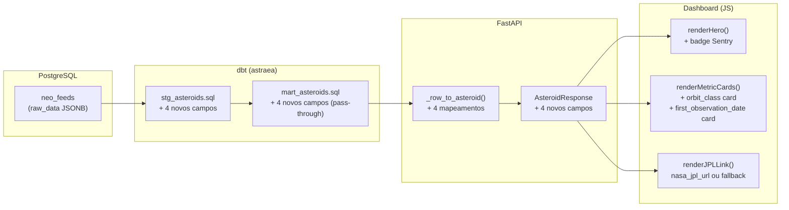

# Design Document — asteroid-new-fields

## Overview

Esta feature propaga quatro novos campos (`orbit_class`, `is_sentry_object`, `first_observation_date`, `nasa_jpl_url`) do `raw_data` armazenado em `neo_feeds` por toda a stack de dados: staging dbt → mart dbt → API FastAPI → dashboard de detalhe.

A mudança é aditiva em todas as camadas: nenhum campo existente é alterado, apenas novos campos são adicionados. O fluxo de dados segue o pipeline já estabelecido no projeto.

## Architecture



Os quatro campos percorrem o pipeline sem transformação: o staging extrai do JSONB, o mart faz pass-through, a API serializa, e o dashboard renderiza.

## Components and Interfaces

### 1. `stg_asteroids.sql` (dbt staging)

Adiciona quatro expressões SQL ao bloco `renamed`:

```sql
-- grupo orbital
raw_data -> 'orbital_data' ->> 'orbit_class_type'        AS orbit_class,

-- presença na lista Sentry
(raw_data ->> 'is_sentry_object')::boolean               AS is_sentry_object,

-- data da primeira observação
raw_data -> 'orbital_data' ->> 'first_observation_date'  AS first_observation_date,

-- link JPL
raw_data ->> 'nasa_jpl_url'                              AS nasa_jpl_url
```

O operador `->>` do PostgreSQL retorna `NULL` naturalmente quando a chave não existe no JSONB, portanto nenhum `COALESCE` é necessário para os requisitos 1.5 e 1.6.

### 2. `mart_asteroids.sql` (dbt mart)

O mart usa `SELECT *` via `ref('stg_asteroids')`, portanto os quatro novos campos são propagados automaticamente sem nenhuma alteração no arquivo. Nenhuma transformação adicional é aplicada (requisito 2.2).

> Decisão de design: o mart já usa `select * from staging` no CTE inicial, então os campos novos aparecem no resultado final sem modificação. Isso mantém o mart focado em scoring de risco.

### 3. `api/models.py` — `AsteroidResponse`

Adiciona quatro campos opcionais ao schema Pydantic:

```python
orbit_class: Optional[str] = None
is_sentry_object: Optional[bool] = None
first_observation_date: Optional[str] = None
nasa_jpl_url: Optional[str] = None
```

`first_observation_date` é `str` (não `date`) porque o valor vem do JSONB como texto livre e pode ter formatos variados (ex.: "1997-03-18").

### 4. `api/routers/asteroids.py` — `_row_to_asteroid()`

Adiciona quatro mapeamentos à função existente:

```python
orbit_class=row.orbit_class,
is_sentry_object=row.is_sentry_object,
first_observation_date=str(row.first_observation_date) if row.first_observation_date is not None else None,
nasa_jpl_url=row.nasa_jpl_url,
```

`first_observation_date` é convertido para `str` para garantir serialização consistente independentemente do tipo retornado pelo driver.

### 5. `dashboard/js/detalhe.js`

#### `renderHero(asteroid)` — badge Sentry

Adiciona o badge condicional ao HTML do hero, após o badge `hazardousBadge` existente:

```js
const sentryBadge = asteroid.is_sentry_object
  ? `<div class="hero__sentry-badge hero__sentry-badge--pulse">
       // LISTA SENTRY
       <span class="hero__sentry-tooltip">
         Este objeto está na lista Sentry da NASA — tem probabilidade não-zero
         de impacto com a Terra nos próximos 100 anos
       </span>
     </div>`
  : "";
```

#### `renderMetricCards(asteroid)` — dois novos cards

Adiciona dois cards ao array `cards` existente:

```js
[
  asteroid.orbit_class ?? "—",
  "Grupo orbital",
  "Classificação do grupo orbital: Apollo (cruzam a órbita da Terra), Aten (órbita menor que a Terra), Amor (aproximam-se mas não cruzam).",
],
[
  formatDate(asteroid.first_observation_date),
  "Descoberto em",
  "Data da primeira observação registrada do asteroide.",
],
```

`formatDate` já trata `null`/`undefined` retornando `"—"`, cobrindo o requisito 6.2.

#### `renderJPLLink(id, url)` — URL dinâmica

Altera a assinatura para receber `url` e usa-a como href com fallback:

```js
function renderJPLLink(id, url) {
  const href = url ?? `https://ssd.jpl.nasa.gov/tools/sbdb_lookup.html#/?sstr=${id}`;
  container.innerHTML = `<a href="${href}" target="_blank" rel="noopener" ...>`;
}
```

A chamada no bootstrap passa `asteroid.nasa_jpl_url`:

```js
renderJPLLink(neoId, asteroid.nasa_jpl_url);
```

## Data Models

### Campos novos no pipeline

| Campo | Fonte no JSONB | Tipo SQL | Tipo Python | Tipo JS |
|---|---|---|---|---|
| `orbit_class` | `orbital_data.orbit_class_type` | `text` (nullable) | `Optional[str]` | `string \| null` |
| `is_sentry_object` | `is_sentry_object` | `boolean` (nullable) | `Optional[bool]` | `boolean \| null` |
| `first_observation_date` | `orbital_data.first_observation_date` | `text` (nullable) | `Optional[str]` | `string \| null` |
| `nasa_jpl_url` | `nasa_jpl_url` | `text` (nullable) | `Optional[str]` | `string \| null` |

### Fluxo de NULL

`NULL` em qualquer nível é propagado sem conversão até o JSON da API, onde aparece como `null`. O dashboard trata `null` com `?? "—"` ou `formatDate()` conforme o campo.


## Correctness Properties

*A property is a characteristic or behavior that should hold true across all valid executions of a system — essentially, a formal statement about what the system should do. Properties serve as the bridge between human-readable specifications and machine-verifiable correctness guarantees.*

### Property 1: Extração dos campos do JSONB no staging

*For any* row em `neo_feeds` cujo `raw_data` contenha os campos `orbital_data.orbit_class_type`, `is_sentry_object`, `orbital_data.first_observation_date` e `nasa_jpl_url`, o modelo `stg_asteroids` deve retornar os valores correspondentes nesses quatro campos — e retornar `NULL` quando qualquer campo estiver ausente no JSONB.

**Validates: Requirements 1.1, 1.2, 1.3, 1.4, 1.5, 1.6**

---

### Property 2: Pass-through dos campos no mart

*For any* row em `stg_asteroids`, os valores de `orbit_class`, `is_sentry_object`, `first_observation_date` e `nasa_jpl_url` retornados por `mart_asteroids` devem ser idênticos aos valores do staging — incluindo `NULL`.

**Validates: Requirements 2.1, 2.2, 2.3**

---

### Property 3: Round-trip do Row_Mapper

*For any* row do banco com valores arbitrários (incluindo `NULL`) nos quatro novos campos, `_row_to_asteroid(row)` deve produzir um `AsteroidResponse` onde cada campo novo é igual ao valor original da row — com `None` quando o valor for `NULL`.

**Validates: Requirements 3.1, 3.2, 3.3, 3.4, 3.5, 3.6, 3.7, 3.8, 3.9**

---

### Property 4: Badge Sentry renderizado quando is_sentry_object é true

*For any* objeto asteroide com `is_sentry_object = true`, a função `renderHero` deve produzir HTML que contenha o texto `// LISTA SENTRY`, a classe CSS de estilo pulsante (`hero__sentry-badge--pulse`) e o texto do tooltip sobre a lista Sentry da NASA.

**Validates: Requirements 4.1, 4.2, 4.4**

---

### Property 5: Badge Sentry omitido quando is_sentry_object é false ou null

*For any* objeto asteroide com `is_sentry_object = false` ou `is_sentry_object = null`, a função `renderHero` deve produzir HTML que não contenha o texto `// LISTA SENTRY`.

**Validates: Requirements 4.3**

---

### Property 6: Metric card de grupo orbital renderiza valor e tooltip

*For any* valor de `orbit_class` (incluindo `null`), a função `renderMetricCards` deve produzir HTML que contenha o label `"Grupo orbital"`, o valor de `orbit_class` (ou `"—"` quando `null`), e o texto do tooltip mencionando Apollo, Aten e Amor.

**Validates: Requirements 5.1, 5.2, 5.3**

---

### Property 7: Metric card de descoberta renderiza data formatada

*For any* valor de `first_observation_date` no formato `"YYYY-MM-DD"` (incluindo `null`), a função `renderMetricCards` deve produzir HTML que contenha o label `"Descoberto em"` e a data formatada em `"DD/MM/YYYY"` (ou `"—"` quando `null`).

**Validates: Requirements 6.1, 6.2**

---

### Property 8: Link JPL usa nasa_jpl_url quando disponível, fallback quando null

*For any* asteroide com `neo_id` arbitrário, a função `renderJPLLink` deve: (a) usar `nasa_jpl_url` como `href` quando o campo não for `null`; (b) usar a URL construída com `neo_id` como `href` quando `nasa_jpl_url` for `null`; e em ambos os casos o HTML deve conter `target="_blank"` e `rel="noopener"`.

**Validates: Requirements 7.1, 7.2, 7.3**

---

## Error Handling

| Situação | Comportamento esperado |
|---|---|
| Campo ausente no JSONB | PostgreSQL `->>` retorna `NULL`; propagado como `None`/`null` em toda a stack |
| `is_sentry_object` com valor não-booleano no JSONB | Cast `::boolean` do PostgreSQL lança erro na ingestão; o coletor é responsável por garantir o tipo correto |
| `nasa_jpl_url` com valor inválido | Exibido como-está no link; o dashboard não valida a URL |
| `first_observation_date` com formato inesperado | `formatDate()` retorna `"—"` para strings que não seguem `"YYYY-MM-DD"` |
| API retorna `null` para campos novos | Dashboard usa `?? "—"` ou `formatDate(null)` para exibição segura |

## Testing Strategy

### Abordagem dual

Testes unitários e testes baseados em propriedades são complementares e ambos necessários:

- **Testes unitários**: verificam exemplos concretos, casos de borda e integração entre componentes
- **Testes de propriedade**: verificam invariantes universais com inputs gerados aleatoriamente

### Testes unitários

**Python (`pytest`) — `api/`**:
- Exemplo: instanciar `AsteroidResponse` com os quatro novos campos e verificar tipos e defaults (Requirements 3.1–3.4)
- Exemplo: chamar `_row_to_asteroid` com um mock de row contendo os quatro campos e verificar o resultado

**JavaScript (`vitest`) — `dashboard/tests/`**:
- Exemplo: `renderHero` com `is_sentry_object=true` contém badge; com `false`/`null` não contém
- Exemplo: `renderJPLLink` com URL real usa a URL; com `null` usa fallback com `neo_id`
- Edge case: `formatDate(null)` retorna `"—"`

**dbt (`dbt test`) — `dbt/astraea/tests/`**:
- Exemplo: query de smoke test verificando que `mart_asteroids` contém as quatro colunas novas

### Testes de propriedade

Biblioteca: **fast-check** (JavaScript, já utilizada no projeto) e **hypothesis** (Python).

Cada teste de propriedade deve rodar no mínimo **100 iterações**.

Tag de referência: `Feature: asteroid-new-fields, Property {N}: {texto}`

| Propriedade | Arquivo de teste | Biblioteca |
|---|---|---|
| Property 3: Round-trip Row_Mapper | `api/tests/test_asteroids_router.py` | hypothesis |
| Property 4: Badge Sentry presente | `dashboard/tests/detalhe.test.js` | fast-check |
| Property 5: Badge Sentry ausente | `dashboard/tests/detalhe.test.js` | fast-check |
| Property 6: Metric card orbit_class | `dashboard/tests/detalhe.test.js` | fast-check |
| Property 7: Metric card first_observation_date | `dashboard/tests/detalhe.test.js` | fast-check |
| Property 8: Link JPL URL selection | `dashboard/tests/detalhe.test.js` | fast-check |

Properties 1 e 2 (camada dbt) são validadas por testes SQL no diretório `dbt/astraea/tests/` usando a abordagem de assertions já estabelecida no projeto.
