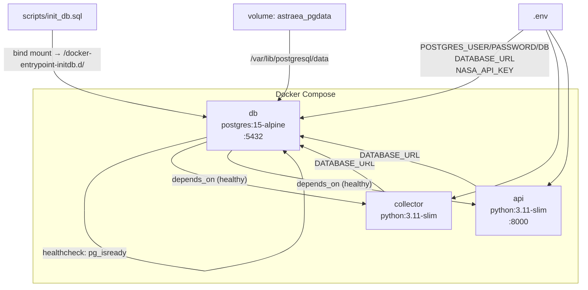

# Design Document — Astraea Base Infrastructure

## Overview

A infraestrutura base da plataforma Astraea define o ambiente containerizado completo para monitoramento de NEOs e eventos solares. O objetivo é permitir que todo o stack (banco de dados, coletor e API) seja levantado com um único `docker compose up -d`, com banco inicializado automaticamente e serviços dependentes aguardando o healthcheck do PostgreSQL.

A abordagem utiliza Docker Compose como orquestrador local, PostgreSQL 15-alpine como banco de dados, e dois serviços Python (collector e api) construídos a partir de Dockerfiles dedicados. A inicialização do schema é feita via bind mount do script SQL no diretório `docker-entrypoint-initdb.d`, aproveitando o comportamento nativo do PostgreSQL.

## Architecture



### Decisões de Design

- **Bind mount para init_db.sql**: O PostgreSQL 15-alpine executa automaticamente qualquer `.sql` em `/docker-entrypoint-initdb.d/` na primeira inicialização. Isso elimina a necessidade de execução manual e mantém o script versionado em `scripts/`.
- **Healthcheck antes de depends_on**: Garante que collector e api só iniciam após o banco estar pronto para aceitar conexões, evitando falhas de conexão no startup.
- **Placeholder com loop infinito**: O `collector/main.py` usa `time.sleep(3600)` para manter o contêiner vivo sem lógica real, evitando restart loops durante o desenvolvimento inicial.
- **IF NOT EXISTS em todo o SQL**: Torna o script idempotente — pode ser re-executado sem erros em bancos já inicializados.

## Components and Interfaces

### docker-compose.yml

Orquestra os três serviços com suas dependências, volumes, portas e variáveis de ambiente.

| Serviço   | Imagem / Build       | Porta  | Depends On       | Restart Policy  |
|-----------|----------------------|--------|------------------|-----------------|
| db        | postgres:15-alpine   | 5432   | —                | —               |
| collector | ./collector          | —      | db (healthy)     | unless-stopped  |
| api       | ./api                | 8000   | db (healthy)     | unless-stopped  |

Healthcheck do db:
```yaml
healthcheck:
  test: ["CMD-SHELL", "pg_isready -U $$POSTGRES_USER -d $$POSTGRES_DB"]
  interval: 10s
  timeout: 5s
  retries: 5
```

Bind mount do init script:
```yaml
volumes:
  - ./scripts/init_db.sql:/docker-entrypoint-initdb.d/init_db.sql
  - astraea_pgdata:/var/lib/postgresql/data
```

### collector/Dockerfile

```
FROM python:3.11-slim
WORKDIR /app
COPY requirements.txt .
RUN pip install --no-cache-dir -r requirements.txt
COPY . .
CMD ["python", "main.py"]
```

### api/Dockerfile

```
FROM python:3.11-slim
WORKDIR /app
COPY requirements.txt .
RUN pip install --no-cache-dir -r requirements.txt
COPY . .
CMD ["uvicorn", "api.main:app", "--host", "0.0.0.0", "--port", "8000"]
```

### scripts/init_db.sql

Script SQL idempotente que cria schemas, tabelas e índices. Executado automaticamente pelo PostgreSQL na primeira inicialização via `docker-entrypoint-initdb.d`.

### .env.example

Documenta todas as variáveis necessárias com valores de exemplo não funcionais.

### .gitignore

Exclui `.env`, artefatos Python, dbt, logs e arquivos de sistema.

## Data Models

### Schema: raw

Armazena dados brutos ingeridos das APIs da NASA sem transformação.

#### raw.neo_feeds

| Coluna       | Tipo                        | Constraints                        |
|--------------|-----------------------------|------------------------------------|
| id           | SERIAL                      | PRIMARY KEY                        |
| neo_id       | VARCHAR(50)                 | NOT NULL                           |
| name         | VARCHAR(200)                | —                                  |
| raw_data     | JSONB                       | NOT NULL                           |
| ingested_at  | TIMESTAMPTZ                 | DEFAULT NOW()                      |
| feed_date    | DATE                        | NOT NULL                           |

Constraints adicionais: `UNIQUE(neo_id, feed_date)`

Índices: `idx_neo_feeds_neo_id`, `idx_neo_feeds_feed_date`

#### raw.solar_events

| Coluna       | Tipo                        | Constraints                        |
|--------------|-----------------------------|------------------------------------|
| id           | SERIAL                      | PRIMARY KEY                        |
| event_id     | VARCHAR(100)                | NOT NULL                           |
| event_type   | VARCHAR(50)                 | NOT NULL                           |
| raw_data     | JSONB                       | NOT NULL                           |
| ingested_at  | TIMESTAMPTZ                 | DEFAULT NOW()                      |
| event_date   | DATE                        | NOT NULL                           |

Índices: `idx_solar_events_event_type`, `idx_solar_events_event_date`

### Schemas: staging, mart

Criados vazios na inicialização. Serão populados por transformações dbt em fases futuras.


## Correctness Properties

*A property is a characteristic or behavior that should hold true across all valid executions of a system — essentially, a formal statement about what the system should do. Properties serve as the bridge between human-readable specifications and machine-verifiable correctness guarantees.*

A maioria dos critérios de aceitação desta feature são verificáveis como exemplos estáticos (leitura de arquivos de configuração). Apenas um critério se eleva ao nível de propriedade universal:

### Property 1: Idempotência do script de inicialização

*For any* banco de dados PostgreSQL — seja recém-criado ou já inicializado — executar o `scripts/init_db.sql` não deve retornar erros nem alterar o estado de objetos já existentes.

Isso é garantido estruturalmente pelo uso de `IF NOT EXISTS` em todos os statements `CREATE SCHEMA`, `CREATE TABLE` e `CREATE INDEX` do script.

**Validates: Requirements 6.6**

---

## Error Handling

| Cenário | Comportamento esperado |
|---|---|
| `.env` ausente ao executar `docker compose up` | Docker Compose falha imediatamente com erro de variável de ambiente ausente, antes de iniciar qualquer contêiner |
| `db` não atinge estado healthy | `collector` e `api` permanecem em estado de espera indefinidamente (depends_on condition: service_healthy) |
| `init_db.sql` executado em banco já inicializado | Todos os `IF NOT EXISTS` garantem execução sem erros e sem alteração de dados |
| `collector/main.py` sem lógica real | Loop `while True: time.sleep(3600)` mantém o contêiner vivo sem consumo de CPU, evitando restart loop |
| Falha de conexão do collector/api ao banco | A política `restart: unless-stopped` reinicia o serviço; o depends_on com healthcheck minimiza essa janela |

## Testing Strategy

### Abordagem Dual

Esta feature é primariamente de infraestrutura — os artefatos são arquivos de configuração estáticos (YAML, SQL, Dockerfile, .env). A estratégia de testes reflete isso:

**Testes de exemplo (unit/integration)**: verificam que cada arquivo existe e contém os valores corretos.

**Testes de propriedade**: verificam a propriedade de idempotência do script SQL.

### Testes de Exemplo

Verificações estáticas dos arquivos gerados:

- `docker-compose.yml` define os serviços `db`, `collector`, `api`
- `db` usa imagem `postgres:15-alpine`, porta `5432:5432`, volume `astraea_pgdata`
- `db` tem healthcheck com `pg_isready`
- `collector` e `api` têm `depends_on: db: condition: service_healthy`
- `collector` e `api` têm `restart: unless-stopped`
- `collector/Dockerfile` usa `python:3.11-slim`, CMD `python main.py`
- `api/Dockerfile` usa `python:3.11-slim`, CMD com `uvicorn api.main:app`
- `collector/main.py` contém `while True:` e `time.sleep(3600)`
- `scripts/init_db.sql` contém `CREATE SCHEMA IF NOT EXISTS` para `raw`, `staging`, `mart`
- `scripts/init_db.sql` contém `CREATE TABLE IF NOT EXISTS raw.neo_feeds` com todas as colunas
- `scripts/init_db.sql` contém `CREATE TABLE IF NOT EXISTS raw.solar_events` com todas as colunas
- `scripts/init_db.sql` contém todos os `CREATE INDEX IF NOT EXISTS` especificados
- `scripts/init_db.sql` contém `UNIQUE(neo_id, feed_date)` em `raw.neo_feeds`
- `.env.example` contém todas as 5 variáveis com valores placeholder
- `.gitignore` exclui `.env`, artefatos Python, dbt, logs e arquivos de sistema
- Diretórios `collector/`, `api/`, `dbt/`, `ml/`, `dashboard/`, `notebooks/`, `scripts/` existem
- `dbt/`, `ml/`, `dashboard/`, `notebooks/` contêm `.gitkeep`

### Testes de Propriedade

**Biblioteca recomendada**: `hypothesis` (Python) para testes de propriedade.

**Property 1: Idempotência do init_db.sql**

Tag: `Feature: astraea-base-infrastructure, Property 1: SQL init script is idempotent`

```python
# Mínimo 100 iterações (configurado via settings do Hypothesis)
# Para qualquer estado de banco (vazio ou já inicializado),
# executar init_db.sql não deve lançar exceção nem alterar
# o schema já existente.
@given(st.just(None))  # estado do banco é fixo; a propriedade é estrutural
@settings(max_examples=100)
def test_init_script_idempotent(db_connection):
    # Feature: astraea-base-infrastructure, Property 1: SQL init script is idempotent
    execute_script(db_connection, "scripts/init_db.sql")
    execute_script(db_connection, "scripts/init_db.sql")  # segunda execução não deve falhar
    assert schemas_exist(db_connection, ["raw", "staging", "mart"])
    assert tables_exist(db_connection, ["raw.neo_feeds", "raw.solar_events"])
```

Na prática, a propriedade é verificada estruturalmente pela presença de `IF NOT EXISTS` em todos os statements — o teste de integração confirma isso contra um PostgreSQL real (ex.: via `pytest` + `testcontainers`).
