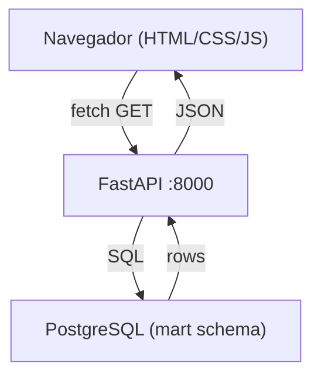
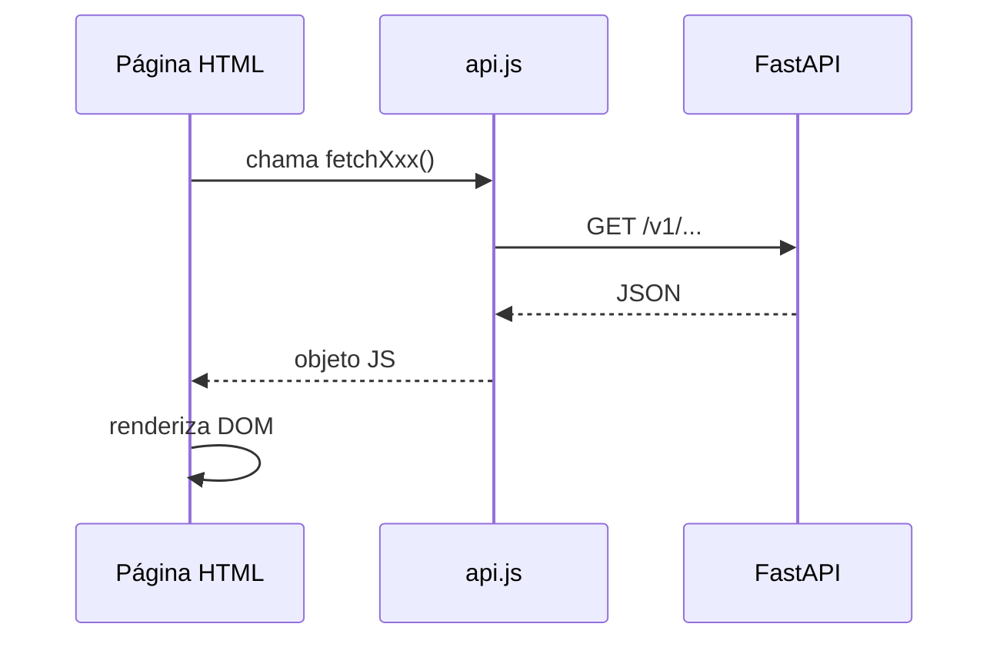

# Design Document — Astraea Dashboard

## Overview

O Astraea Dashboard é uma interface web estática composta por 5 páginas HTML que consomem a API FastAPI em `http://localhost:8000`. Não há framework JavaScript, bundler ou dependência de build — todo o código roda diretamente no navegador via `<script>` tags e `fetch()` nativo.

O objetivo é apresentar dados de NEOs (Near-Earth Objects) e eventos solares com estética de painel científico dark, priorizando legibilidade de dados numéricos e navegação clara entre as seções.

### Decisões de design

- **Sem framework**: mantém zero dependência de build, facilita hospedagem estática e reduz superfície de manutenção.
- **Módulos ES via `type="module"`**: permite `import/export` sem bundler, mantendo separação de responsabilidades entre arquivos JS.
- **`js/config.js` + `js/api.js` carregados primeiro**: garante que a URL base e as funções de fetch estejam disponíveis antes de qualquer script de página.
- **Fontes via Google Fonts CDN**: Space Mono e Inter carregadas no `<head>` de cada página.

---

## Architecture

O dashboard segue uma arquitetura cliente-servidor simples: o navegador serve os arquivos estáticos e faz chamadas REST à API FastAPI.



### Fluxo de dados por página



### Carregamento de scripts

Cada página carrega os scripts na seguinte ordem via `<script type="module">`:

```
config.js → api.js → [script da página].js
```

`config.js` e `api.js` são importados como módulos ES pelos scripts de página, não como scripts globais separados.

---

## Components and Interfaces

### `js/config.js`

Exporta a constante de configuração global:

```js
export const CONFIG = {
  API_BASE_URL: "http://localhost:8000/v1",
};
```

### `js/api.js`

Centraliza todas as chamadas à API. Cada função retorna uma Promise que resolve com o objeto JSON ou rejeita com um `Error` descritivo em português.

```js
// Assinaturas das funções exportadas
export async function fetchStats()
// GET /v1/stats/summary → StatsResponse

export async function fetchUpcoming()
// GET /v1/asteroids/upcoming → AsteroidResponse[]

export async function fetchAsteroids({ limit, offset, hazardous, risk_label })
// GET /v1/asteroids → AsteroidResponse[]

export async function fetchAsteroid(neo_id)
// GET /v1/asteroids/{neo_id} → AsteroidResponse

export async function fetchSolarEvents({ limit, offset, event_type })
// GET /v1/solar-events → SolarEventResponse[]

export async function fetchEarthDirected()
// GET /v1/solar-events/earth-directed → SolarEventResponse[]
```

Tratamento de erro interno em `api.js`:

```js
async function apiFetch(path) {
  const res = await fetch(CONFIG.API_BASE_URL + path);
  if (!res.ok) throw new Error(`Erro ${res.status}: não foi possível carregar os dados.`);
  return res.json();
}
```

### Componentes visuais reutilizáveis (implementados em CSS + JS inline)

| Componente | Descrição |
|---|---|
| `Nav` | Barra de navegação com logo e 4 links; link ativo destacado via classe `.active` |
| `Risk_Badge` | `<span class="badge badge--alto|médio|baixo">` |
| `Stat_Card` | Card com valor, label e ícone `?` com tooltip |
| `Metric_Card` | Variante do Stat_Card para página de detalhe |
| `Spinner` | `<div class="spinner">` exibido durante fetch |
| `Error_Message` | `<p class="error-msg">` com texto em português |
| `Countdown` | Elemento atualizado a cada segundo via `setInterval` |
| `Status_Bar` | Faixa no topo da home com indicador pulsante |

### Scripts de página

| Arquivo | Responsabilidade |
|---|---|
| `js/home.js` | Chama `fetchStats`, `fetchUpcoming`, `fetchSolarEvents`; renderiza Status_Bar, hero, Stat_Cards, tabela de upcoming e cards de eventos recentes |
| `js/asteroides.js` | Chama `fetchAsteroids` com parâmetros de filtro/paginação; renderiza tabela e controles |
| `js/detalhe.js` | Lê `?id=` da URL; chama `fetchAsteroid`; renderiza hero, countdown, metric cards e painel ML |
| `js/eventos.js` | Chama `fetchSolarEvents` com filtro de tipo; renderiza cards de eventos |

---

## Data Models

Os modelos abaixo refletem diretamente os schemas Pydantic da API (`api/models.py`), convertidos para o formato que o JS recebe via JSON.

### AsteroidResponse

```ts
interface AsteroidResponse {
  neo_id: string;
  name: string | null;
  feed_date: string;           // "YYYY-MM-DD"
  close_approach_date: string | null;
  miss_distance_lunar: number | null;
  miss_distance_km: number | null;
  relative_velocity_km_s: number | null;
  velocity_km_per_h: number | null;
  estimated_diameter_min_km: number | null;
  estimated_diameter_max_km: number | null;
  absolute_magnitude_h: number | null;
  is_potentially_hazardous: boolean | null;
  risk_label: string | null;   // "ALTO" | "MÉDIO" | "BAIXO"
  risk_score_ml: number | null; // 0.0 – 1.0
  risk_label_ml: string | null; // "alto" | "médio" | "baixo"
}
```

### SolarEventResponse

```ts
interface SolarEventResponse {
  event_id: string;
  event_type: string;          // "CME" | "GST"
  event_date: string;          // "YYYY-MM-DD"
  start_time: string | null;
  speed_km_s: number | null;
  cme_type: string | null;
  half_angle_deg: number | null;
  latitude: number | null;
  longitude: number | null;
  kp_index_max: number | null;
  note: string | null;
  intensity_label: string | null; // "ALTO" | "MÉDIO" | "BAIXO"
}
```

### StatsResponse

```ts
interface StatsResponse {
  total_asteroids: number;
  hazardous_count: number;
  high_risk_ml: number;
  medium_risk_ml: number;
  low_risk_ml: number;
  total_solar_events: number;
  cme_count: number;
  gst_count: number;
  closest_approach_lunar: number | null;
  closest_asteroid_name: string | null;
}
```

### Estado de UI (por página)

Cada script de página mantém um estado local simples em variáveis de módulo:

```js
// asteroides.js
let currentOffset = 0;
let currentFilters = { hazardous: null, risk_label: null };

// detalhe.js
const neoId = new URLSearchParams(location.search).get("id");

// eventos.js
let currentEventType = null;
```


---

## Correctness Properties

*A property is a characteristic or behavior that should hold true across all valid executions of a system — essentially, a formal statement about what the system should do. Properties serve as the bridge between human-readable specifications and machine-verifiable correctness guarantees.*

### Property 1: Risk Badge mapeia label para classe CSS correta

*Para qualquer* valor de label de risco (`"alto"`, `"médio"`, `"baixo"`), a função que gera o HTML do Risk_Badge deve retornar um elemento contendo a classe CSS correspondente à cor correta (`badge--alto`, `badge--médio`, `badge--baixo`).

**Validates: Requirements 1.5**

---

### Property 2: Link ativo na navegação corresponde à página atual

*Para qualquer* página do dashboard, a função que marca o link ativo deve resultar em exatamente um link com a classe `.active`, e esse link deve ter o `href` correspondente ao arquivo HTML da página atual.

**Validates: Requirements 2.3**

---

### Property 3: Hero da home reflete contagem real de upcoming asteroids

*Para qualquer* array de `AsteroidResponse` retornado por `fetchUpcoming`, o texto renderizado no hero deve conter exatamente o número de itens do array.

**Validates: Requirements 3.2**

---

### Property 4: Stat Cards renderizam todos os valores de StatsResponse com tooltips

*Para qualquer* `StatsResponse` válido, a função de renderização dos Stat_Cards deve produzir exatamente 4 cards, cada um contendo o valor numérico correto e um elemento de tooltip com texto não vazio em português.

**Validates: Requirements 3.3, 3.4**

---

### Property 5: Tabela de upcoming contém todas as colunas obrigatórias

*Para qualquer* array não vazio de `AsteroidResponse`, a tabela renderizada deve conter as colunas: nome, data de aproximação, distância em LD, distância em km, velocidade em km/s, diâmetro estimado e Risk_Badge.

**Validates: Requirements 3.5**

---

### Property 6: Cards de eventos solares contêm os campos disponíveis

*Para qualquer* `SolarEventResponse`, o card renderizado deve conter `event_type`, `event_date`, e — quando o campo não for `null` — `speed_km_s`, `kp_index_max`, `intensity_label` como Risk_Badge e `note`.

**Validates: Requirements 3.7, 6.4**

---

### Property 7: Tratamento de erro HTTP exibe mensagem em português

*Para qualquer* resposta HTTP com status fora do intervalo 2xx, a função `apiFetch` deve rejeitar com um `Error` cuja mensagem seja uma string não vazia em português descrevendo o problema.

**Validates: Requirements 3.9, 3.10, 4.7, 6.6, 8.3**

---

### Property 8: Construção de query string de filtros de asteroides

*Para qualquer* combinação de parâmetros de filtro (`risk_label`, `hazardous`, `limit`, `offset`), a URL construída por `fetchAsteroids` deve conter exatamente os query params fornecidos e omitir os que forem `null` ou `undefined`.

**Validates: Requirements 4.2, 4.3**

---

### Property 9: Paginação incrementa e decrementa offset em 50

*Para qualquer* valor de `offset` atual, clicar em "Próximo" deve resultar em `offset + 50` e clicar em "Anterior" deve resultar em `max(0, offset - 50)`.

**Validates: Requirements 4.5**

---

### Property 10: Extração de parâmetro `id` da URL

*Para qualquer* string de URL que contenha `?id=X`, a função de extração deve retornar `X`; para qualquer URL sem o parâmetro `id`, deve retornar `null`.

**Validates: Requirements 5.1, 5.9**

---

### Property 11: Breadcrumb contém o nome do asteroide

*Para qualquer* `AsteroidResponse` com campo `name` não nulo, o breadcrumb renderizado deve conter a string `"Home"`, `"Asteroides"` e o nome do asteroide, nessa ordem.

**Validates: Requirements 5.2**

---

### Property 12: Countdown retorna valores positivos para datas futuras

*Para qualquer* data de `close_approach_date` posterior à data atual, a função de cálculo do countdown deve retornar valores não negativos de dias, horas e minutos; para datas passadas ou iguais à data atual, não deve exibir o countdown.

**Validates: Requirements 5.4**

---

### Property 13: Painel ML exibe risk_score_ml e risk_label_ml corretamente

*Para qualquer* `AsteroidResponse` com `risk_score_ml` não nulo, o painel ML renderizado deve conter uma barra de progresso com valor proporcional a `risk_score_ml` (0–100%) e um Risk_Badge com o `risk_label_ml` correspondente.

**Validates: Requirements 5.6**

---

### Property 14: URL do NASA JPL contém o neo_id correto

*Para qualquer* `neo_id` válido, a função que gera o link externo deve retornar a URL `https://ssd.jpl.nasa.gov/tools/sbdb_lookup.html#/?sstr={neo_id}` com o `neo_id` corretamente interpolado.

**Validates: Requirements 5.7**

---

### Property 15: Construção de query string de filtro de eventos solares

*Para qualquer* valor de `event_type` selecionado (`"CME"`, `"GST"` ou `null`), a URL construída por `fetchSolarEvents` deve conter o parâmetro `event_type` quando não nulo, e omiti-lo quando nulo.

**Validates: Requirements 6.2**

---

### Property 16: Funções de fetch usam CONFIG.API_BASE_URL como prefixo

*Para qualquer* valor de `CONFIG.API_BASE_URL`, todas as URLs construídas pelas funções de `api.js` devem começar com esse valor.

**Validates: Requirements 8.2**

---

## Error Handling

### Estratégia geral

Todos os erros de fetch são capturados em `apiFetch()` e propagados como `Error` com mensagem em português. Cada script de página envolve as chamadas em `try/catch` e chama uma função `showError(container, message)` que substitui o conteúdo do container pelo componente `Error_Message`.

```js
// Padrão em todos os scripts de página
try {
  showSpinner(container);
  const data = await fetchXxx();
  render(container, data);
} catch (err) {
  showError(container, err.message);
}
```

### Casos específicos

| Situação | Comportamento |
|---|---|
| Status 404 em `/asteroids/{neo_id}` | Exibe "Asteroide não encontrado." no container principal |
| `?id` ausente em `detalhe.html` | Redireciona imediatamente para `asteroides.html` via `location.replace()` |
| Qualquer status 5xx | Exibe "Erro no servidor. Tente novamente mais tarde." |
| Timeout / rede indisponível | Exibe "Não foi possível conectar à API. Verifique sua conexão." |
| Array vazio retornado | Exibe mensagem "Nenhum dado encontrado." no lugar da tabela/cards |

### Loading states

- Antes de cada fetch: `showSpinner(container)` insere `<div class="spinner">` no container
- Após resolução (sucesso ou erro): spinner é removido e substituído pelo conteúdo ou mensagem de erro

---

## Testing Strategy

### Abordagem dual

O dashboard usa dois tipos complementares de teste:

- **Testes unitários**: verificam exemplos específicos, casos de borda e conteúdo estático dos arquivos HTML
- **Testes de propriedade**: verificam propriedades universais das funções de renderização e lógica de negócio

### Ferramentas

| Tipo | Biblioteca | Justificativa |
|---|---|---|
| Unit + Property | [fast-check](https://github.com/dubzzz/fast-check) + [Vitest](https://vitest.dev/) | fast-check é a biblioteca PBT mais madura para JS/TS; Vitest roda sem bundler com `--run` |

### Testes unitários (exemplos e casos de borda)

- Estrutura de arquivos: verificar que todos os 12 arquivos existem
- Conteúdo estático: verificar presença de nav, footer, links corretos em cada HTML
- `sobre.html`: verificar presença de stack técnica e links para NASA NeoWs e DONKI
- Edge case 5.8: `fetchAsteroid` com 404 → mensagem "Asteroide não encontrado"
- Edge case 5.9: URL sem `?id=` → `extractNeoId()` retorna `null`
- Inicialização de `asteroides.html` com `limit=50, offset=0`

### Testes de propriedade (fast-check)

Cada propriedade do design deve ser implementada por **um único** teste de propriedade com mínimo de **100 iterações**.

Tag de referência obrigatória em cada teste:
```
// Feature: astraea-dashboard, Property N: <texto da propriedade>
```

| Propriedade | Gerador fast-check |
|---|---|
| P1: Risk Badge | `fc.constantFrom("alto", "médio", "baixo")` |
| P2: Link ativo na nav | `fc.constantFrom("index.html", "asteroides.html", "eventos.html", "sobre.html")` |
| P3: Hero contagem upcoming | `fc.array(asteroidArb)` |
| P4: Stat Cards com tooltips | `statsResponseArb` |
| P5: Tabela upcoming colunas | `fc.array(asteroidArb, { minLength: 1 })` |
| P6: Cards de eventos solares | `solarEventArb` |
| P7: Erro HTTP → mensagem PT | `fc.integer({ min: 400, max: 599 })` |
| P8: Query string asteroides | `fc.record({ risk_label, hazardous, limit, offset })` |
| P9: Paginação offset | `fc.nat()` |
| P10: Extração de ?id= | `fc.string()` (com e sem parâmetro id) |
| P11: Breadcrumb com nome | `asteroidArb` com name não nulo |
| P12: Countdown datas futuras | `fc.date({ min: new Date() })` |
| P13: Painel ML | `asteroidArb` com risk_score_ml não nulo |
| P14: URL NASA JPL | `fc.string({ minLength: 1 })` como neo_id |
| P15: Query string eventos | `fc.constantFrom("CME", "GST", null)` |
| P16: API_BASE_URL como prefixo | `fc.webUrl()` como CONFIG.API_BASE_URL |

### Configuração dos testes de propriedade

```js
// vitest.config.js
export default {
  test: {
    globals: true,
  }
}

// Exemplo de teste de propriedade
import fc from "fast-check";
import { describe, it, expect } from "vitest";
import { renderRiskBadge } from "../js/ui.js";

describe("astraea-dashboard", () => {
  it("P1: Risk Badge mapeia label para classe CSS correta", () => {
    // Feature: astraea-dashboard, Property 1: Risk Badge mapeia label para classe CSS correta
    fc.assert(
      fc.property(
        fc.constantFrom("alto", "médio", "baixo"),
        (label) => {
          const html = renderRiskBadge(label);
          return html.includes(`badge--${label}`);
        }
      ),
      { numRuns: 100 }
    );
  });
});
```

### Executar testes

```bash
npx vitest --run
```
