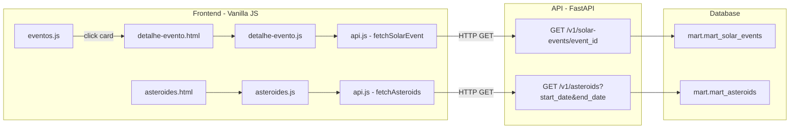

# Documento de Design — Astraea v1.1: Detalhe de Evento Solar e Filtros

## Visão Geral

Este design cobre três funcionalidades da release v1.1 do Astraea:

1. **Endpoint de detalhe de evento solar** (`GET /v1/solar-events/{event_id}`) — segue o padrão existente de `GET /v1/asteroids/{neo_id}` no router `solar_events.py`
2. **Página de detalhe de evento solar** (`detalhe-evento.html` + `detalhe-evento.js`) — segue o padrão de `detalhe.html` + `detalhe.js`
3. **Filtro por data na página de asteroides** — adiciona campos `start_date` e `end_date` em `asteroides.html` e `asteroides.js`

### Decisões de Design

- **Reutilização máxima de padrões**: cada componente novo replica a estrutura do componente análogo existente (router, página, função API, testes)
- **Sem novas dependências**: o backend já suporta `start_date`/`end_date` no router de asteroides; o frontend apenas precisa enviar os parâmetros
- **Campo `is_earth_directed`**: já existe na staging (`stg_solar_events.sql`) e é propagado pelo mart. Precisa ser adicionado ao modelo Pydantic `SolarEventResponse` e ao mapper `_row_to_solar`
- **Sem alteração no dbt**: o campo `is_earth_directed` já flui de `stg_solar_events` → `mart_solar_events` via `SELECT *`

## Arquitetura

A arquitetura segue o padrão existente do Astraea:



### Fluxo de Dados

1. **Detalhe de evento solar**: `eventos.js` → click no card → `detalhe-evento.html?id={event_id}` → `detalhe-evento.js` → `fetchSolarEvent(id)` → `GET /v1/solar-events/{event_id}` → `mart.mart_solar_events`
2. **Filtro por data**: `asteroides.html` → input de data → `asteroides.js` → `fetchAsteroids({start_date, end_date, ...})` → `GET /v1/asteroids?start_date=...&end_date=...` → `mart.mart_asteroids`

## Componentes e Interfaces

### 1. Backend — `api/routers/solar_events.py`

**Novo endpoint**: `GET /v1/solar-events/{event_id}`

Segue exatamente o padrão de `GET /v1/asteroids/{neo_id}` em `asteroids.py`:

```python
@router.get("/solar-events/{event_id}", response_model=SolarEventResponse)
@limiter.limit("60/minute")
def get_solar_event(request: Request, event_id: str, db: Session = Depends(get_db)):
    sql = text("SELECT * FROM mart.mart_solar_events WHERE event_id = :event_id")
    row = db.execute(sql, {"event_id": event_id}).fetchone()
    if row is None:
        raise HTTPException(status_code=404, detail="Solar event not found")
    return _row_to_solar(row)
```

**Alteração no modelo** `SolarEventResponse` (`api/models.py`):
- Adicionar campo `is_earth_directed: Optional[bool] = None`

**Alteração no mapper** `_row_to_solar`:
- Adicionar mapeamento de `is_earth_directed` do row para o response

### 2. Backend — `api/models.py`

Adicionar ao `SolarEventResponse`:

```python
is_earth_directed: Optional[bool] = None
```

### 3. Frontend — `dashboard/js/api.js`

**Nova função**: `fetchSolarEvent(eventId)`

```javascript
export async function fetchSolarEvent(eventId) {
  return apiFetch(`/v1/solar-events/${eventId}`);
}
```

**Alteração em `fetchAsteroids`**: adicionar suporte a `start_date` e `end_date` nos parâmetros:

```javascript
export async function fetchAsteroids({ limit, offset, hazardous, risk_label, start_date, end_date } = {}) {
  const params = new URLSearchParams();
  // ... params existentes ...
  if (start_date != null) params.append("start_date", start_date);
  if (end_date != null) params.append("end_date", end_date);
  // ...
}
```

### 4. Frontend — `dashboard/detalhe-evento.html`

Nova página HTML seguindo o padrão de `detalhe.html`:
- Nav, breadcrumb, footer, bottom nav mobile — idênticos ao padrão
- Breadcrumb: `Visão geral › Eventos Solares › {event_type}`
- Container principal com seções para hero, métricas e link externo
- Carrega `js/detalhe-evento.js` como módulo ES

### 5. Frontend — `dashboard/js/detalhe-evento.js`

Novo módulo JS seguindo o padrão de `detalhe.js`:


**Responsabilidades**:
- Extrair `id` da query string (`URLSearchParams`)
- Se `id` ausente → redirecionar para `eventos.html`
- Chamar `fetchSolarEvent(id)` de `api.js`
- Renderizar badge de tipo (CME/GST) com cores de `eventos.js` (`typeBadgeStyle`)
- Renderizar data formatada em português (reutilizar `formatDatePT` de `eventos.js` ou replicar)
- Renderizar campos condicionais por tipo:
  - CME: velocidade, `is_earth_directed`, link DONKI
  - GST: `kp_index_max`
- Renderizar nota/descrição quando disponível
- Renderizar link externo para NASA DONKI
- Tratar erros (404 → "Evento não encontrado", outros → mensagem do erro)

**Funções auxiliares reutilizadas/replicadas**:
- `formatDatePT(dateStr)` — formata data em português (ex: "15 de março de 2024")
- `typeBadgeStyle(type)` — retorna estilo inline para badge CME/GST
- `showSpinner`, `showError`, `setActiveNav` — de `ui.js`

### 6. Frontend — `dashboard/js/eventos.js`

**Alteração**: tornar cada card clicável, envolvendo-o em um link ou adicionando `onclick`:

```javascript
// No renderCard, envolver o card em um <a>:
function renderCard(ev) {
  // ... card HTML existente ...
  return `<a href="detalhe-evento.html?id=${ev.event_id}" class="event-card-link" style="text-decoration:none;color:inherit;cursor:pointer">
    <div class="event-card">...</div>
  </a>`;
}
```

Adicionar CSS para `cursor: pointer` no hover do card.

### 7. Frontend — `dashboard/asteroides.html` + `dashboard/js/asteroides.js`

**HTML**: adicionar dois campos `<input type="date">` na div `#filters`:

```html
<label class="filter-date">
  <span>De:</span>
  <input type="date" id="start-date" />
</label>
<label class="filter-date">
  <span>Até:</span>
  <input type="date" id="end-date" />
</label>
```

**JS**: ler valores dos inputs, passar para `fetchAsteroids`, resetar paginação ao alterar:

```javascript
const startDateInput = document.getElementById("start-date");
const endDateInput = document.getElementById("end-date");

// No loadAsteroids:
const data = await fetchAsteroids({
  limit: LIMIT,
  offset: currentOffset,
  risk_label: currentRisk,
  hazardous: currentHazardous,
  start_date: startDateInput?.value || null,
  end_date: endDateInput?.value || null,
});

// Event listeners:
startDateInput?.addEventListener("change", () => { currentOffset = 0; loadAsteroids(); });
endDateInput?.addEventListener("change", () => { currentOffset = 0; loadAsteroids(); });
```

## Modelos de Dados

### SolarEventResponse (atualizado)

```python
class SolarEventResponse(BaseModel):
    event_id: str
    event_type: str                        # "CME" | "GST"
    event_date: date
    start_time: Optional[str] = None
    speed_km_s: Optional[float] = None     # apenas CME
    cme_type: Optional[str] = None         # apenas CME
    half_angle_deg: Optional[float] = None # apenas CME
    latitude: Optional[float] = None       # apenas CME
    longitude: Optional[float] = None      # apenas CME
    kp_index_max: Optional[float] = None   # apenas GST
    note: Optional[str] = None
    intensity_label: Optional[str] = None
    is_earth_directed: Optional[bool] = None  # NOVO — apenas CME
```

### Tabela `mart.mart_solar_events` (colunas relevantes)

| Coluna | Tipo | Descrição |
|--------|------|-----------|
| `event_id` | `text` | ID único do evento (PK) |
| `event_type` | `text` | "CME" ou "GST" |
| `event_date` | `date` | Data do evento |
| `speed_km_s` | `numeric` | Velocidade da CME em km/s |
| `kp_index_max` | `numeric` | Índice Kp máximo (GST) |
| `is_earth_directed` | `boolean` | Se a CME é direcionada à Terra |
| `note` | `text` | Descrição/nota do evento |
| `intensity_label` | `text` | Label calculado: extremo/severo/moderado/fraco |

### URL DONKI para eventos solares

O link externo para a fonte NASA DONKI segue o padrão:
- CME: `https://kauai.ccmc.gsfc.nasa.gov/DONKI/view/CME/{event_id_encoded}`
- GST: `https://kauai.ccmc.gsfc.nasa.gov/DONKI/view/GST/{event_id_encoded}`

O `event_id` armazenado no banco já contém o identificador DONKI (ex: `2024-01-01T00:00:00-CME-001`).


## Propriedades de Corretude

*Uma propriedade é uma característica ou comportamento que deve ser verdadeiro em todas as execuções válidas de um sistema — essencialmente, uma declaração formal sobre o que o sistema deve fazer. Propriedades servem como ponte entre especificações legíveis por humanos e garantias de corretude verificáveis por máquina.*

### Propriedade 1: Round-trip do Row Mapper de eventos solares

*Para qualquer* combinação válida de valores nos campos de um row de `mart_solar_events` (incluindo `None` para campos nullable como `is_earth_directed`, `speed_km_s`, `kp_index_max`, `note`), a função `_row_to_solar` deve produzir um `SolarEventResponse` com todos os campos preservando os mesmos valores do row original.

**Valida: Requisitos 1.1, 1.4**

### Propriedade 2: Badge de tipo renderiza estilo correto

*Para qualquer* evento solar com `event_type` sendo "CME" ou "GST", a função de renderização do badge deve produzir HTML contendo o texto do tipo e o estilo de cor correspondente (azul para CME, âmbar para GST).

**Valida: Requisitos 2.4**

### Propriedade 3: Formatação de data em português

*Para qualquer* data válida no formato "YYYY-MM-DD", a função `formatDatePT` deve produzir uma string contendo o dia (sem zero à esquerda), o nome do mês em português e o ano com 4 dígitos.

**Valida: Requisitos 2.5**

### Propriedade 4: Renderização condicional da nota

*Para qualquer* evento solar, se o campo `note` é uma string não-vazia, o HTML renderizado deve conter o texto da nota; se `note` é `null` ou vazio, o HTML não deve conter a seção de nota.

**Valida: Requisitos 2.6**

### Propriedade 5: Campos específicos por tipo de evento

*Para qualquer* evento solar do tipo CME, o HTML renderizado deve conter os campos de velocidade (`speed_km_s`), direcionamento à Terra (`is_earth_directed`) e link DONKI. *Para qualquer* evento do tipo GST, o HTML renderizado deve conter o campo de índice Kp (`kp_index_max`) e não deve conter campos exclusivos de CME.

**Valida: Requisitos 2.7, 2.8, 2.9**

### Propriedade 6: Construção de URL do fetchSolarEvent

*Para qualquer* string `eventId` não-vazia, a função `fetchSolarEvent` deve construir a URL no formato exato `/v1/solar-events/${eventId}` e delegá-la para `apiFetch`.

**Valida: Requisitos 3.2**

### Propriedade 7: Card de evento contém link para página de detalhe

*Para qualquer* evento solar renderizado como card, o HTML resultante deve conter um link (`href`) apontando para `detalhe-evento.html?id={event_id}` onde `{event_id}` é o ID do evento.

**Valida: Requisitos 4.1**

### Propriedade 8: Construção de query string com filtros de data

*Para qualquer* combinação de valores `start_date` e `end_date` (cada um podendo ser uma data válida ou `null`), a query string construída por `fetchAsteroids` deve incluir o parâmetro `start_date` se e somente se o valor não é `null`, e incluir `end_date` se e somente se o valor não é `null`.

**Valida: Requisitos 5.2, 5.4, 5.5**

## Tratamento de Erros

### Backend

| Cenário | Status | Resposta |
|---------|--------|----------|
| `event_id` não encontrado | 404 | `{"detail": "Solar event not found"}` |
| Rate limit excedido | 429 | `{"error": "Rate limit exceeded: 60 per 1 minute"}` com header `Retry-After` |
| Erro interno do banco | 500 | Resposta padrão do FastAPI |

### Frontend — `detalhe-evento.js`

| Cenário | Comportamento |
|---------|---------------|
| Parâmetro `id` ausente na URL | Redireciona para `eventos.html` |
| API retorna 404 | Exibe "Evento solar não encontrado." via `showError` |
| API retorna outro erro | Exibe mensagem de erro retornada via `showError` |
| Falha de conexão | Exibe "Não foi possível conectar à API." (tratado por `apiFetch`) |

### Frontend — `asteroides.js` (filtro de data)

| Cenário | Comportamento |
|---------|---------------|
| Campos de data vazios | Omite parâmetros, comportamento padrão sem filtro |
| Apenas `start_date` preenchido | Envia só `start_date` na query string |
| Apenas `end_date` preenchido | Envia só `end_date` na query string |
| Ambos preenchidos | Envia ambos na query string |

## Estratégia de Testes

### Abordagem Dual

A estratégia combina testes unitários (exemplos específicos) com testes de propriedade (verificação universal):

- **Testes de propriedade**: verificam propriedades universais com 100+ iterações usando inputs gerados aleatoriamente
- **Testes unitários**: cobrem exemplos específicos, edge cases e cenários de erro

### Backend — Python (Hypothesis)

**Testes de propriedade** (`api/tests/test_solar_events_router.py`):
- **Propriedade 1**: Round-trip do `_row_to_solar` — gerar rows aleatórios com `SimpleNamespace`, passar pelo mapper, verificar que todos os campos são preservados
  - Biblioteca: `hypothesis`
  - Mínimo 100 iterações
  - Tag: `Feature: astraea-v1-1-solar-detail-and-filters, Property 1: Round-trip do Row Mapper de eventos solares`

**Testes unitários**:
- Endpoint retorna 404 para `event_id` inexistente (Requisito 1.2)
- Rate limiter aplicado ao endpoint (Requisito 1.3)

### Frontend — JavaScript (fast-check + Vitest)

**Testes de propriedade** (`dashboard/tests/detalhe-evento.test.js`):
- **Propriedade 2**: Badge de tipo — gerar eventos com tipo CME/GST, verificar estilo correto
- **Propriedade 3**: Formatação de data — gerar datas aleatórias, verificar formato português
- **Propriedade 4**: Nota condicional — gerar eventos com/sem nota, verificar presença/ausência
- **Propriedade 5**: Campos por tipo — gerar CMEs e GSTs, verificar campos específicos
- **Propriedade 7**: Card link — gerar eventos, verificar link correto no card

**Testes de propriedade** (`dashboard/tests/api.test.js`):
- **Propriedade 6**: URL do fetchSolarEvent — gerar eventIds, verificar URL construída
- **Propriedade 8**: Query string com datas — gerar combinações de start_date/end_date, verificar inclusão/omissão

Todos os testes de propriedade:
- Biblioteca: `fast-check`
- Mínimo 100 iterações (`{ numRuns: 100 }`)
- Cada teste referencia a propriedade do design com tag no formato: `Feature: astraea-v1-1-solar-detail-and-filters, Property {N}: {título}`

**Testes unitários**:
- Redirecionamento quando `id` ausente (Requisito 2.3)
- Exibição de erro 404 (Requisito 2.10)
- Exibição de erro genérico (Requisito 2.11)
- Reset de paginação ao alterar data (Requisito 5.3)
