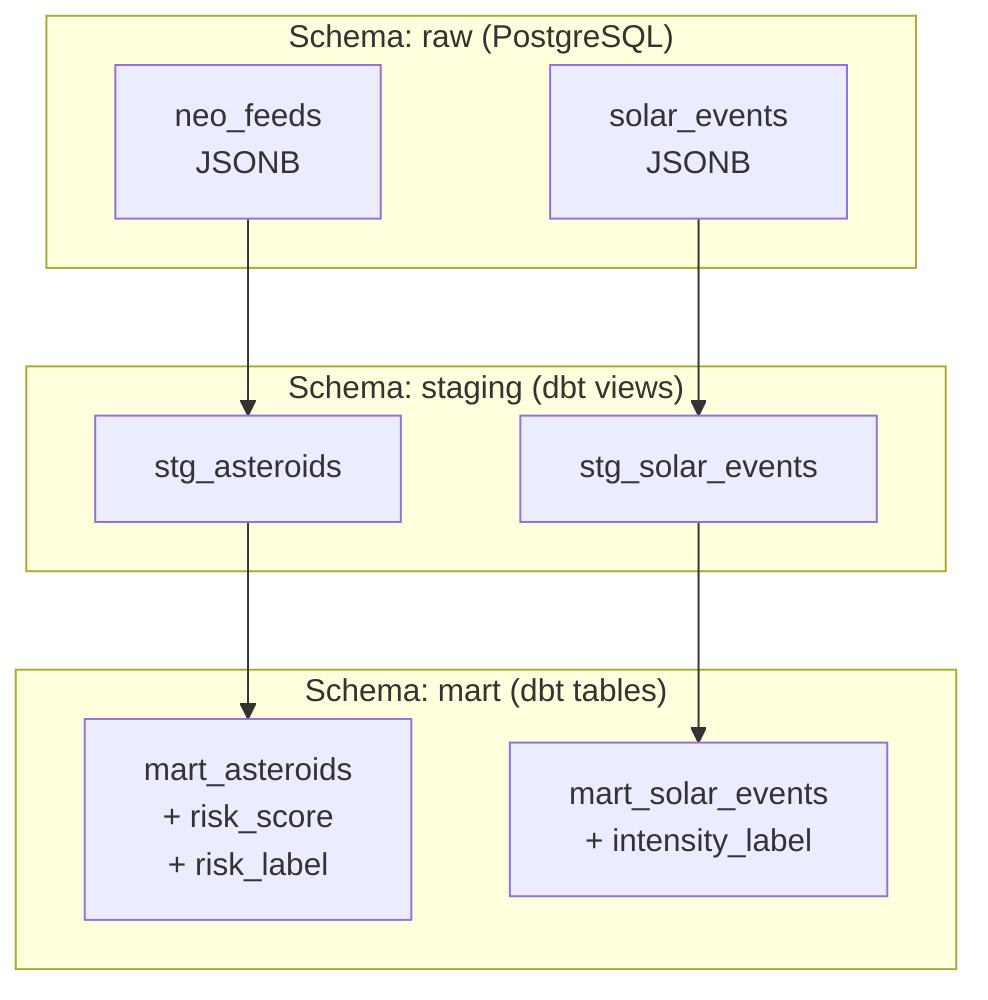

# Design Document — dbt Transformation Models

## Overview

Este documento descreve a arquitetura técnica dos modelos dbt para o projeto Astraea. O objetivo é criar uma pipeline de transformação SQL reproduzível que extrai campos JSONB das tabelas raw, estrutura os dados nas camadas staging e enriquece com regras de negócio na camada mart.

**Stack:**
- dbt-postgres 1.8.2 (venv `.venv-dbt`)
- PostgreSQL 15 em `localhost:5432`
- Banco: `astraea` | Schemas: `raw`, `staging`, `mart`

**Fontes de dados:**
- `raw.neo_feeds` — asteroides próximos da Terra (NASA NeoWs API), campo `raw_data` JSONB com estrutura da API NeoWs
- `raw.solar_events` — eventos solares CME e GST (NASA DONKI API), campo `raw_data` JSONB com estrutura variável por tipo

---

## Architecture

A pipeline segue o padrão medallion de três camadas:

```
raw.neo_feeds          raw.solar_events
      │                       │
      ▼                       ▼
staging.stg_asteroids   staging.stg_solar_events
      │                       │
      ▼                       ▼
mart.mart_asteroids     mart.mart_solar_events
```



**Decisões de design:**
- Staging materializado como `view` — sem duplicação de dados, sempre reflete o estado atual do raw
- Mart materializado como `table` — performance para queries da API e futura ingestão pelo modelo ML
- Extração JSONB feita inteiramente em SQL via operadores `->>`/`->` do PostgreSQL — sem dependências externas
- `risk_score` implementado como soma de CASE WHEN — determinístico, substituível por ML na Task 04

---

## Components and Interfaces

### Estrutura de Diretórios

```
dbt/
└── astraea/
    ├── dbt_project.yml
    ├── models/
    │   ├── staging/
    │   │   ├── sources.yml
    │   │   ├── stg_asteroids.sql
    │   │   └── stg_solar_events.sql
    │   └── mart/
    │       ├── mart_asteroids.sql
    │       └── mart_solar_events.sql
    └── tests/
        └── (testes customizados, se necessário)
```

### profiles.yml (`~/.dbt/profiles.yml`)

```yaml
astraea:
  target: dev
  outputs:
    dev:
      type: postgres
      host: localhost
      port: 5432
      user: astraea
      password: changeme
      dbname: astraea
      schema: staging
      threads: 4
```

### dbt_project.yml

```yaml
name: astraea
version: '1.0.0'
profile: astraea

model-paths: ["models"]
test-paths: ["tests"]
seed-paths: ["seeds"]
macro-paths: ["macros"]

models:
  astraea:
    staging:
      +materialized: view
      +schema: staging
    mart:
      +materialized: table
      +schema: mart
```

### sources.yml (`models/staging/sources.yml`)

Declara as tabelas raw como sources dbt com testes de qualidade:

```yaml
version: 2

sources:
  - name: astraea
    database: astraea
    schema: raw
    tables:
      - name: neo_feeds
        columns:
          - name: id
          - name: neo_id
            tests: [not_null]
          - name: name
          - name: raw_data
          - name: feed_date
            tests: [not_null]
          - name: ingested_at
      - name: solar_events
        columns:
          - name: id
          - name: event_id
            tests: [not_null]
          - name: event_type
            tests: [not_null]
          - name: raw_data
          - name: event_date
          - name: ingested_at
```

> Nota: O teste `unique` combinado `(neo_id, feed_date)` já é garantido pela constraint `uq_neo_feeds_neo_id_feed_date` no banco. Para dbt, pode ser implementado via `dbt_utils.unique_combination_of_columns` ou teste customizado em SQL.

---

## Data Models

### stg_asteroids

Extrai e tipifica campos do JSONB da API NeoWs. A estrutura do `raw_data` segue o formato da NASA NeoWs API onde `close_approach_data` é um array.

```sql
-- models/staging/stg_asteroids.sql
{{ config(materialized='view', schema='staging') }}

SELECT
    neo_id::text,
    name::text,
    feed_date::date,
    (raw_data->>'absolute_magnitude_h')::float          AS absolute_magnitude_h,
    (raw_data->>'is_potentially_hazardous_asteroid')::boolean AS is_potentially_hazardous,
    (raw_data->'estimated_diameter'->'kilometers'->>'estimated_diameter_min')::float
                                                         AS estimated_diameter_min_km,
    (raw_data->'estimated_diameter'->'kilometers'->>'estimated_diameter_max')::float
                                                         AS estimated_diameter_max_km,
    (raw_data->'close_approach_data'->0->>'close_approach_date')::date
                                                         AS close_approach_date,
    (raw_data->'close_approach_data'->0->'relative_velocity'->>'kilometers_per_second')::float
                                                         AS relative_velocity_km_s,
    (raw_data->'close_approach_data'->0->'miss_distance'->>'kilometers')::float
                                                         AS miss_distance_km
FROM {{ source('astraea', 'neo_feeds') }}
```

**Campos extraídos:**

| Campo | Tipo | Caminho JSONB |
|---|---|---|
| `neo_id` | text | coluna direta |
| `name` | text | coluna direta |
| `feed_date` | date | coluna direta |
| `absolute_magnitude_h` | float | `raw_data->>'absolute_magnitude_h'` |
| `is_potentially_hazardous` | boolean | `raw_data->>'is_potentially_hazardous_asteroid'` |
| `estimated_diameter_min_km` | float | `raw_data->'estimated_diameter'->'kilometers'->>'estimated_diameter_min'` |
| `estimated_diameter_max_km` | float | `raw_data->'estimated_diameter'->'kilometers'->>'estimated_diameter_max'` |
| `close_approach_date` | date | `raw_data->'close_approach_data'->0->>'close_approach_date'` |
| `relative_velocity_km_s` | float | `raw_data->'close_approach_data'->0->'relative_velocity'->>'kilometers_per_second'` |
| `miss_distance_km` | float | `raw_data->'close_approach_data'->0->'miss_distance'->>'kilometers'` |

> Campos JSONB ausentes retornam NULL automaticamente via operadores `->>`/`->` do PostgreSQL — sem necessidade de COALESCE para o comportamento de NULL.

---

### stg_solar_events

Extrai campos do JSONB para CME e GST. Campos específicos de cada tipo retornam NULL para o outro tipo.

```sql
-- models/staging/stg_solar_events.sql
{{ config(materialized='view', schema='staging') }}

SELECT
    event_id::text,
    event_type::text,
    event_date::date,
    (raw_data->>'startTime')::timestamp                  AS start_time,
    -- CME fields
    CASE WHEN event_type = 'CME' THEN raw_data->>'type'       END::text    AS cme_type,
    CASE WHEN event_type = 'CME' THEN (raw_data->'cmeAnalyses'->0->>'speed')::float END AS speed_km_s,
    CASE WHEN event_type = 'CME' THEN (raw_data->'cmeAnalyses'->0->>'halfAngle')::float END AS half_angle_deg,
    CASE WHEN event_type = 'CME' THEN (raw_data->'cmeAnalyses'->0->>'latitude')::float END AS latitude,
    CASE WHEN event_type = 'CME' THEN (raw_data->'cmeAnalyses'->0->>'longitude')::float END AS longitude,
    CASE WHEN event_type = 'CME' THEN raw_data->>'note'       END::text    AS note,
    -- GST fields
    CASE WHEN event_type = 'GST'
         THEN (raw_data->'allKpIndex'->0->>'kpIndex')::float
    END                                                  AS kp_index_max
FROM {{ source('astraea', 'solar_events') }}
```

**Campos extraídos:**

| Campo | Tipo | Disponível para |
|---|---|---|
| `event_id` | text | CME, GST |
| `event_type` | text | CME, GST |
| `event_date` | date | CME, GST |
| `start_time` | timestamp | CME, GST |
| `cme_type` | text | CME only (NULL para GST) |
| `speed_km_s` | float | CME only |
| `half_angle_deg` | float | CME only |
| `latitude` | float | CME only |
| `longitude` | float | CME only |
| `note` | text | CME only |
| `kp_index_max` | float | GST only (NULL para CME) |

---

### mart_asteroids

Enriquece `stg_asteroids` com `risk_score` e `risk_label`.

```sql
-- models/mart/mart_asteroids.sql
{{ config(materialized='table', schema='mart') }}

WITH scored AS (
    SELECT
        *,
        (
            CASE WHEN is_potentially_hazardous = true  THEN 3 ELSE 0 END +
            CASE WHEN relative_velocity_km_s > 20      THEN 2 ELSE 0 END +
            CASE WHEN miss_distance_km < 1000000       THEN 2 ELSE 0 END +
            CASE WHEN estimated_diameter_max_km > 0.5  THEN 1 ELSE 0 END
        )::integer AS risk_score
    FROM {{ ref('stg_asteroids') }}
)
SELECT
    *,
    CASE
        WHEN risk_score >= 6 THEN 'alto'
        WHEN risk_score >= 3 THEN 'médio'
        ELSE                      'baixo'
    END AS risk_label
FROM scored
```

**Regras de risk_score:**

| Condição | Pontos |
|---|---|
| `is_potentially_hazardous = true` | +3 |
| `relative_velocity_km_s > 20` | +2 |
| `miss_distance_km < 1_000_000` | +2 |
| `estimated_diameter_max_km > 0.5` | +1 |
| **Máximo possível** | **8** |

**Mapeamento risk_label:**

| risk_score | risk_label |
|---|---|
| >= 6 | `'alto'` |
| >= 3 | `'médio'` |
| < 3 | `'baixo'` |

---

### mart_solar_events

Enriquece `stg_solar_events` com `intensity_label`.

```sql
-- models/mart/mart_solar_events.sql
{{ config(materialized='table', schema='mart') }}

SELECT
    *,
    CASE
        WHEN event_type = 'CME' THEN
            CASE
                WHEN speed_km_s >= 1000 THEN 'extremo'
                WHEN speed_km_s >= 500  THEN 'moderado'
                ELSE                         'fraco'
            END
        WHEN event_type = 'GST' THEN
            CASE
                WHEN kp_index_max >= 8 THEN 'extremo'
                WHEN kp_index_max >= 7 THEN 'severo'
                WHEN kp_index_max >= 5 THEN 'moderado'
                ELSE                        'fraco'
            END
        ELSE 'desconhecido'
    END AS intensity_label
FROM {{ ref('stg_solar_events') }}
```

**Mapeamento intensity_label:**

| event_type | Condição | intensity_label |
|---|---|---|
| CME | `speed_km_s >= 1000` | `'extremo'` |
| CME | `speed_km_s >= 500` | `'moderado'` |
| CME | `speed_km_s < 500` | `'fraco'` |
| GST | `kp_index_max >= 8` | `'extremo'` |
| GST | `kp_index_max >= 7` | `'severo'` |
| GST | `kp_index_max >= 5` | `'moderado'` |
| GST | `kp_index_max < 5` | `'fraco'` |
| outro | — | `'desconhecido'` |


---

## Correctness Properties

*A property is a characteristic or behavior that should hold true across all valid executions of a system — essentially, a formal statement about what the system should do. Properties serve as the bridge between human-readable specifications and machine-verifiable correctness guarantees.*

### Property 1: Invariante de contagem — pipeline de asteroides

*For any* conjunto de registros em `raw.neo_feeds`, o número de linhas em `staging.stg_asteroids` deve ser igual ao número de linhas em `raw.neo_feeds`, e o número de linhas em `mart.mart_asteroids` deve ser igual ao número de linhas em `staging.stg_asteroids`.

**Validates: Requirements 4.4, 6.6, 8.3, 8.5**

---

### Property 2: Invariante de contagem — pipeline de eventos solares

*For any* conjunto de registros em `raw.solar_events`, o número de linhas em `staging.stg_solar_events` deve ser igual ao número de linhas em `raw.solar_events`, e o número de linhas em `mart.mart_solar_events` deve ser igual ao número de linhas em `staging.stg_solar_events`.

**Validates: Requirements 5.4, 7.5, 8.4, 8.6**

---

### Property 3: Extração JSONB de asteroides preserva dados

*For any* registro em `raw.neo_feeds` com um `raw_data` JSONB válido (incluindo registros com campos ausentes), `stg_asteroids` deve retornar os campos tipificados corretamente quando presentes, e NULL quando o caminho JSONB não existir — sem lançar erros.

**Validates: Requirements 4.1, 4.5**

---

### Property 4: Extração JSONB de eventos solares por tipo

*For any* registro em `raw.solar_events` com `event_type = 'CME'`, os campos CME (`speed_km_s`, `cme_type`, etc.) devem ser extraídos e os campos GST (`kp_index_max`) devem ser NULL. *For any* registro com `event_type = 'GST'`, o inverso deve ser verdadeiro. Campos JSONB ausentes devem retornar NULL sem erro.

**Validates: Requirements 5.1, 5.5**

---

### Property 5: Cálculo determinístico do risk_score

*For any* registro de asteroide com valores conhecidos de `is_potentially_hazardous`, `relative_velocity_km_s`, `miss_distance_km` e `estimated_diameter_max_km`, o `risk_score` calculado deve ser exatamente igual à soma das regras determinísticas: 3 pontos se `is_potentially_hazardous`, 2 se `velocity > 20`, 2 se `miss_distance < 1_000_000`, 1 se `diameter_max > 0.5`.

**Validates: Requirements 6.2**

---

### Property 6: Invariante de domínio do risk_score

*For any* registro válido em `mart.mart_asteroids`, o valor de `risk_score` deve ser um inteiro no intervalo fechado [0, 8].

**Validates: Requirements 6.7, 8.7**

---

### Property 7: Mapeamento correto do risk_label

*For any* registro em `mart.mart_asteroids`, o `risk_label` deve ser exatamente `'alto'` quando `risk_score >= 6`, `'médio'` quando `risk_score >= 3`, e `'baixo'` quando `risk_score < 3`. O conjunto de valores possíveis é estritamente `{'alto', 'médio', 'baixo'}`.

**Validates: Requirements 6.3, 8.7**

---

### Property 8: Cálculo correto do intensity_label

*For any* registro em `mart.mart_solar_events` com `event_type = 'CME'` e `speed_km_s` conhecido, o `intensity_label` deve seguir os limiares de velocidade. *For any* registro com `event_type = 'GST'` e `kp_index_max` conhecido, o `intensity_label` deve seguir os limiares de índice Kp. *For any* registro com `event_type` diferente de CME ou GST, o `intensity_label` deve ser `'desconhecido'`.

**Validates: Requirements 7.2**

---

### Property 9: Invariante de domínio do intensity_label

*For any* registro válido em `mart.mart_solar_events`, o valor de `intensity_label` deve ser um dos cinco valores permitidos: `'extremo'`, `'severo'`, `'moderado'`, `'fraco'`, `'desconhecido'`.

**Validates: Requirements 7.6, 8.8**

---

## Error Handling

### Campos JSONB ausentes

O PostgreSQL retorna NULL automaticamente quando um caminho JSONB não existe via operadores `->>`/`->`. Nenhum tratamento adicional é necessário nos modelos SQL — o comportamento de NULL é o correto por design.

Casos cobertos:
- Campo de primeiro nível ausente: `raw_data->>'campo_inexistente'` → NULL
- Caminho aninhado ausente: `raw_data->'nivel1'->'nivel2'->>'campo'` → NULL
- Array vazio ou índice inexistente: `raw_data->'close_approach_data'->0` → NULL

### Valores NULL em cálculos de score

No `mart_asteroids`, se `is_potentially_hazardous`, `relative_velocity_km_s`, `miss_distance_km` ou `estimated_diameter_max_km` forem NULL (campo JSONB ausente no raw), o CASE WHEN retorna 0 para aquela condição — o `risk_score` ainda é calculado sem erro, apenas sem aquele componente.

No `mart_solar_events`, se `speed_km_s` for NULL para um CME ou `kp_index_max` for NULL para um GST, o CASE WHEN retorna `'fraco'` (o ELSE do CASE interno) — comportamento conservador e seguro.

### Falha de conexão dbt

O dbt exibe mensagens de erro descritivas via `dbt debug`. Erros de conexão são reportados com o parâmetro inválido identificado (host, port, credenciais).

---

## Testing Strategy

### Abordagem dual: testes dbt + property-based testing

**Testes dbt** (integração com banco real):
- `dbt test --select source:astraea` — valida `not_null` e `unique` nas sources
- `dbt test` — valida todos os modelos após `dbt run`
- Testes customizados em `tests/` para invariantes de contagem e domínio

**Property-based tests** (pytest + Hypothesis):
- Validam as propriedades de corretude sem depender do banco real
- Testam a lógica SQL replicada em Python ou via banco de teste em memória (SQLite/DuckDB)
- Mínimo de 100 iterações por propriedade (configurado via `@settings(max_examples=100)`)

### Biblioteca de property-based testing

**Hypothesis** (Python) — compatível com o stack existente (Python/pytest).

```python
from hypothesis import given, settings
from hypothesis import strategies as st
```

### Configuração dos testes de propriedade

Cada teste deve ser anotado com o comentário de rastreabilidade:

```python
# Feature: dbt-transformation-models, Property N: <texto da propriedade>
@settings(max_examples=100)
@given(...)
def test_property_N_nome():
    ...
```

### Mapeamento propriedades → testes

| Propriedade | Tipo | Abordagem |
|---|---|---|
| P1: Contagem asteroides | property | Hypothesis: gerar listas de registros, verificar len(staging) == len(raw) == len(mart) |
| P2: Contagem solar | property | Hypothesis: gerar listas de eventos, verificar contagens |
| P3: Extração JSONB asteroides | property | Hypothesis: gerar dicts JSONB com campos presentes/ausentes, verificar tipos e NULLs |
| P4: Extração JSONB solar | property | Hypothesis: gerar eventos CME/GST, verificar campos corretos e NULLs cruzados |
| P5: Cálculo risk_score | property | Hypothesis: gerar combinações booleanas/numéricas, verificar soma exata |
| P6: Domínio risk_score | property | Hypothesis: gerar qualquer asteroide válido, verificar 0 <= risk_score <= 8 |
| P7: Mapeamento risk_label | property | Hypothesis: gerar risk_scores, verificar label correto e conjunto fechado |
| P8: Cálculo intensity_label | property | Hypothesis: gerar eventos com speeds/kp_index aleatórios, verificar label correto |
| P9: Domínio intensity_label | property | Hypothesis: gerar qualquer evento, verificar label em conjunto permitido |

### Testes unitários (exemplos concretos)

Focados em casos específicos e edge cases:
- Asteroide com todos os campos presentes → risk_score = 8
- Asteroide com nenhum campo de risco → risk_score = 0
- CME com speed = 1000 → `'extremo'` (limite exato)
- GST com kp_index = 7 → `'severo'` (limite exato)
- Registro com raw_data JSONB vazio `{}` → todos os campos NULL, sem erro
- event_type desconhecido → intensity_label = `'desconhecido'`

### Testes dbt customizados (SQL)

Para invariantes de contagem e domínio diretamente no banco:

```sql
-- tests/assert_asteroids_count_preserved.sql
SELECT COUNT(*) FROM {{ ref('mart_asteroids') }}
HAVING COUNT(*) != (SELECT COUNT(*) FROM {{ source('astraea', 'neo_feeds') }})

-- tests/assert_risk_score_range.sql
SELECT * FROM {{ ref('mart_asteroids') }}
WHERE risk_score < 0 OR risk_score > 8

-- tests/assert_risk_label_values.sql
SELECT * FROM {{ ref('mart_asteroids') }}
WHERE risk_label NOT IN ('alto', 'médio', 'baixo')

-- tests/assert_intensity_label_values.sql
SELECT * FROM {{ ref('mart_solar_events') }}
WHERE intensity_label NOT IN ('extremo', 'severo', 'moderado', 'fraco', 'desconhecido')
```
