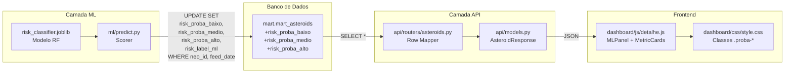

# Design — Probabilidades ML Completas

## Visão Geral

Este design detalha a refatoração do pipeline de scoring ML do Astraea para expor as três probabilidades completas do `predict_proba` (baixo, médio, alto) em todas as camadas do sistema: Scorer (`ml/predict.py`) → banco (`mart.mart_asteroids`) → API (`api/`) → frontend (`dashboard/`). A UI será redesenhada para exibir barras de distribuição de probabilidade em vez da barra de "confiança" semanticamente incorreta.

### Decisões de Design

1. **Migração DDL fora do Scorer**: As colunas `risk_proba_baixo`, `risk_proba_medio`, `risk_proba_alto` são adicionadas via SQL manual. O Scorer nunca executa `ALTER TABLE`.
2. **Chave composta (neo_id, feed_date)**: A tabela `mart_asteroids` tem múltiplas linhas por `neo_id`. O UPDATE usa `WHERE neo_id = :neo_id AND feed_date = :feed_date`.
3. **Tolerância de acentuação**: O modelo retorna `['alto', 'baixo', 'médio']`. O mapeamento normaliza acentos (aceita "medio" e "médio") para encontrar os índices corretos em `model.classes_`.
4. **scikit-learn 1.5.2**: Versão pinada em produção. Nenhuma alteração de dependência.
5. **Eliminação de risk_score_ml**: Removido do código (Scorer, API, frontend). A coluna no banco é removida manualmente como última etapa, após validação completa.

## Arquitetura

O fluxo de dados segue a arquitetura existente em 4 camadas, com alterações cirúrgicas em cada uma:



### Ordem de Execução

1. **Migração SQL manual** — adicionar 3 colunas `NUMERIC(6,4)`
2. **Camada ML** — refatorar `ml/predict.py`
3. **Camada API** — atualizar `models.py`, `routers/asteroids.py`, testes
4. **Frontend** — reescrever MLPanel, MetricCards, adicionar CSS
5. **Migração final** — `DROP COLUMN risk_score_ml` (manual, após validação)

## Componentes e Interfaces

### 1. Migração SQL (manual pelo desenvolvedor)

```sql
ALTER TABLE mart.mart_asteroids ADD COLUMN IF NOT EXISTS risk_proba_baixo NUMERIC(6,4);
ALTER TABLE mart.mart_asteroids ADD COLUMN IF NOT EXISTS risk_proba_medio NUMERIC(6,4);
ALTER TABLE mart.mart_asteroids ADD COLUMN IF NOT EXISTS risk_proba_alto  NUMERIC(6,4);
```

Executada uma única vez antes do deploy do Scorer refatorado.

### 2. Scorer (`ml/predict.py`)

#### Validação de classes

```python
def _validate_and_map_classes(model) -> dict[str, int]:
    """Retorna mapeamento {'baixo': idx, 'medio': idx, 'alto': idx}."""
```

- Normaliza acentos via `unicodedata.normalize('NFD')` + strip de combining chars
- Mapeia cada classe de `model.classes_` para a forma canônica sem acento
- Valida que exatamente 3 classes mapeáveis existem (baixo, medio, alto)
- Lança `ValueError` descritivo se falhar

#### SELECT de dados — colunas explícitas

O SELECT do Scorer deve retornar exatamente estas colunas:

| Coluna | Propósito |
|--------|-----------|
| `neo_id` | Chave composta — parte 1 |
| `feed_date` | Chave composta — parte 2 (snapshot de ingestão) |
| `miss_distance_lunar` | Feature do modelo |
| `relative_velocity_km_s` | Feature do modelo |
| `estimated_diameter_min_km` | Usado para calcular `diameter_avg_km` |
| `estimated_diameter_max_km` | Usado para calcular `diameter_avg_km` |
| `absolute_magnitude_h` | Feature do modelo |
| `is_potentially_hazardous` | Feature do modelo |

```sql
SELECT neo_id, feed_date,
       miss_distance_lunar, relative_velocity_km_s,
       estimated_diameter_min_km, estimated_diameter_max_km,
       absolute_magnitude_h, is_potentially_hazardous
FROM mart.mart_asteroids
```

Cada record do batch deve carregar `feed_date` consigo até o momento do UPDATE — sem isso, a cláusula `WHERE neo_id = :neo_id AND feed_date = :feed_date` falha.

#### Extração de probabilidades

```python
probas = model.predict_proba(X)  # shape (n, 3)
labels = model.predict(X)

records = [
    {
        "neo_id": row.neo_id,
        "feed_date": row.feed_date,
        "risk_proba_baixo": float(probas[i, idx_baixo]),
        "risk_proba_medio": float(probas[i, idx_medio]),
        "risk_proba_alto":  float(probas[i, idx_alto]),
        "risk_label_ml":    str(labels[i]),
    }
    for i, row in enumerate(...)
]
```

#### UPDATE com chave composta

```sql
UPDATE mart.mart_asteroids
SET risk_proba_baixo = :risk_proba_baixo,
    risk_proba_medio = :risk_proba_medio,
    risk_proba_alto  = :risk_proba_alto,
    risk_label_ml    = :risk_label_ml
WHERE neo_id = :neo_id AND feed_date = :feed_date
```

#### Remoções

- Remover toda referência a `risk_score_ml` na construção de records
- Remover os dois `ALTER TABLE ... ADD COLUMN` existentes (risk_score_ml e risk_label_ml)

### 3. API — Modelo Pydantic (`api/models.py`)

Substituir `risk_score_ml: Optional[float]` por:

```python
risk_proba_baixo: Optional[float] = None
risk_proba_medio: Optional[float] = None
risk_proba_alto:  Optional[float] = None
```

Manter `risk_label_ml: Optional[str] = None` inalterado.

### 4. API — Row Mapper (`api/routers/asteroids.py`)

Na função `_row_to_asteroid`, substituir:

```python
risk_score_ml=float(v) if (v := _safe_get(row, "risk_score_ml")) is not None else None,
```

Por:

```python
risk_proba_baixo=float(v) if (v := _safe_get(row, "risk_proba_baixo")) is not None else None,
risk_proba_medio=float(v) if (v := _safe_get(row, "risk_proba_medio")) is not None else None,
risk_proba_alto=float(v) if (v := _safe_get(row, "risk_proba_alto")) is not None else None,
```

### 5. Frontend — MLPanel (`dashboard/js/detalhe.js`)

#### Função utilitária `normalizeRiskClass(label)`

Função que normaliza o label de risco removendo acentos via decomposição Unicode (mesma técnica do Scorer Python), retornando sempre `'baixo'`, `'medio'` ou `'alto'` (sem acento). Toda construção de className para `.risk-badge--{classe}` e `.proba-bar-fill--{classe}` deve passar por essa função, eliminando dependência de codificação UTF-8 consistente entre HTML, CSS e JS.

```javascript
function normalizeRiskClass(label) {
  return (label || "").normalize("NFD").replace(/[\u0300-\u036f]/g, "").toLowerCase();
}
```

#### Reescrita completa de `renderMLPanel`

Lógica:

1. Se qualquer uma das 3 probabilidades for `null` → exibir "Análise de risco indisponível para este objeto"
2. Caso contrário:
   - Badge de risco (pill) com `risk_label_ml`
   - Frase: "Classificado como [classe] risco com [X]% de probabilidade"
   - 3 barras horizontais (`.proba-row`) com label, track, fill e valor percentual
   - Disclaimer em itálico

#### Estrutura HTML gerada

```html
<div class="ml-panel">
  <p class="section-label">análise de risco — modelo ml</p>
  <div style="..."><span class="risk-badge risk-badge--{classe}">CLASSE</span></div>
  <p>Classificado como <strong>{classe}</strong> risco com <strong>{X}%</strong> de probabilidade</p>
  <div class="proba-row">
    <span class="proba-row__label">baixo</span>
    <div class="proba-bar-track"><div class="proba-bar-fill" style="width:{Y}%;background:#22c55e"></div></div>
    <span class="proba-row__value">{Y}%</span>
  </div>
  <!-- médio e alto análogos -->
  <p><em>Este modelo não substitui avaliações oficiais da NASA</em></p>
</div>
```

### 6. Frontend — MetricCards (`dashboard/js/detalhe.js`)

No card "Score ML", substituir:

- Valor: `Math.round(proba_da_classe_predita * 100)` + "% probabilidade" + badge
- Label: "Score ML" (mantido)
- Tooltip: "Probabilidade atribuída pelo modelo de machine learning à classe de risco predita."
- Remover toda menção a "confiança"

### 7. Frontend — CSS (`dashboard/css/style.css`)

Novas classes:

```css
.proba-row { display: grid; grid-template-columns: 60px 1fr 50px; align-items: center; gap: 8px; }
.proba-row + .proba-row { margin-top: 12px; }
.proba-row__label { font-family: var(--font-mono); font-size: 0.7rem; color: var(--muted); text-transform: uppercase; }
.proba-row__value { font-family: var(--font-mono); font-size: 0.8rem; color: var(--text); text-align: right; }
.proba-bar-track { height: 8px; background: rgba(255,255,255,0.05); border-radius: 4px; overflow: hidden; }
.proba-bar-fill { height: 8px; border-radius: 4px; transition: width 0.4s ease; }
.risk-badge { display: inline-block; padding: 0.2em 0.6em; border-radius: 4px; font-family: var(--font-mono); font-size: 0.6875rem; font-weight: 700; letter-spacing: 0.05em; text-transform: uppercase; color: #fff; }
.risk-badge--baixo { background: #22c55e; }
.risk-badge--medio { background: #f59e0b; }
.risk-badge--alto { background: #ef4444; }
```

**Nota:** Apenas `.risk-badge--medio` (sem acento). Toda construção de className no JS passa pela função `normalizeRiskClass(label)` que normaliza acentos antes de gerar a classe CSS.

### 8. Remoção de CSS inline obsoleto (`dashboard/detalhe.html`)

Remover do bloco `<style>` inline as regras `.risk-scale`, `.risk-scale__low`, `.risk-scale__mid`, `.risk-scale__high`, `.risk-scale__marker`, `.risk-scale-wrap`, `.risk-scale-labels` — não são mais usadas.

## Modelos de Dados

### Tabela `mart.mart_asteroids` — colunas afetadas

| Coluna | Tipo | Estado |
|--------|------|--------|
| `risk_proba_baixo` | `NUMERIC(6,4)` | **Nova** — adicionada via migração |
| `risk_proba_medio` | `NUMERIC(6,4)` | **Nova** — adicionada via migração |
| `risk_proba_alto` | `NUMERIC(6,4)` | **Nova** — adicionada via migração |
| `risk_label_ml` | `VARCHAR(10)` | Existente — mantida |
| `risk_score_ml` | `NUMERIC(6,4)` | Existente — removida na migração final |

Chave composta para UPDATE: `(neo_id, feed_date)`.

### Modelo Pydantic `AsteroidResponse` — campos afetados

```python
# Removido:
risk_score_ml: Optional[float] = None

# Adicionados:
risk_proba_baixo: Optional[float] = None
risk_proba_medio: Optional[float] = None
risk_proba_alto:  Optional[float] = None

# Mantido:
risk_label_ml: Optional[str] = None
```

### Contrato JSON da API (exemplo)

```json
{
  "neo_id": "2000001",
  "name": "1 Ceres",
  "feed_date": "2024-06-01",
  "risk_label_ml": "baixo",
  "risk_proba_baixo": 0.8523,
  "risk_proba_medio": 0.1044,
  "risk_proba_alto": 0.0433,
  "...": "demais campos inalterados"
}
```

## Propriedades de Corretude

*Uma propriedade é uma característica ou comportamento que deve ser verdadeiro em todas as execuções válidas de um sistema — essencialmente, uma declaração formal sobre o que o sistema deve fazer. Propriedades servem como ponte entre especificações legíveis por humanos e garantias de corretude verificáveis por máquina.*

### Propriedade 1: Validação de classes com tolerância de acentuação

*Para qualquer* permutação de um array contendo exatamente as classes "baixo", "medio"/"médio" e "alto" (com ou sem acento), a função de validação SHALL retornar um mapeamento correto de índices onde cada chave canônica ("baixo", "medio", "alto") aponta para a posição correta no array original.

**Valida: Requisitos 2.1, 2.3, 2.4**

### Propriedade 2: Rejeição de classes inválidas

*Para qualquer* array de strings que não contenha exatamente três classes mapeáveis para {baixo, medio, alto}, a função de validação SHALL lançar um `ValueError` com mensagem descritiva contendo as classes encontradas.

**Valida: Requisito 2.2**

### Propriedade 3: Extração de probabilidades preserva ordem e valores

*Para qualquer* array numpy de shape (n, 3) contendo probabilidades válidas (cada linha soma 1.0) e *para qualquer* mapeamento de índices válido `{'baixo': i, 'medio': j, 'alto': k}` onde `{i, j, k} = {0, 1, 2}`, a função de extração de probabilidades SHALL retornar os valores corretos na ordem `(probas[row, i], probas[row, j], probas[row, k])` para cada registro, preservando a correspondência entre classe e coluna.

**Valida: Requisitos 3.1, 3.4**

### Propriedade 4: Round-trip do Row Mapper com probabilidades

*Para qualquer* combinação de valores `(float | None)` nos campos `risk_proba_baixo`, `risk_proba_medio` e `risk_proba_alto` de uma row SQL, `_row_to_asteroid` SHALL produzir um `AsteroidResponse` com os mesmos valores de probabilidade (float preservado, None preservado).

**Valida: Requisitos 6.1, 6.2, 6.3, 6.5, 7.3**

### Propriedade 5: MLPanel renderiza distribuição completa

*Para qualquer* asteroide com as três probabilidades não-nulas (somando ≈1.0) e um `risk_label_ml` válido, `renderMLPanel` SHALL produzir HTML contendo: (a) um badge com a classe predita, (b) a frase "Classificado como {classe} risco com {X}% de probabilidade" onde X = `Math.round(proba_da_classe * 100)`, e (c) três barras `.proba-row` com os percentuais corretos de cada classe.

**Valida: Requisitos 8.2, 8.3, 8.4, 8.6**

### Propriedade 6: MLPanel oculta seção quando probabilidade é null

*Para qualquer* asteroide onde pelo menos uma das três probabilidades (`risk_proba_baixo`, `risk_proba_medio`, `risk_proba_alto`) é `null`, `renderMLPanel` SHALL exibir "Análise de risco indisponível para este objeto" e SHALL NOT renderizar barras de probabilidade.

**Valida: Requisito 8.8**

### Propriedade 7: Eliminação do termo "confiança"

*Para qualquer* asteroide com dados válidos, a saída HTML combinada de `renderMLPanel` e `renderMetricCards` SHALL NOT conter a palavra "confiança" em nenhuma forma.

**Valida: Requisitos 8.9, 10.4, 12.1, 12.2, 12.3**

## Tratamento de Erros

### Camada ML (`ml/predict.py`)

| Cenário | Comportamento |
|---------|---------------|
| `model.classes_` não contém 3 classes mapeáveis | `ValueError` com mensagem listando classes encontradas |
| `DATABASE_URL` não definida | `EnvironmentError` (comportamento existente, mantido) |
| Modelo não encontrado em disco | `FileNotFoundError` (comportamento existente, mantido) |
| Falha de conexão com banco | Exceção do SQLAlchemy propagada (comportamento existente) |

### Camada API

| Cenário | Comportamento |
|---------|---------------|
| Coluna de probabilidade não existe no banco (pré-migração) | `_safe_get` retorna `None` → campo `null` no JSON |
| Asteroide não encontrado | HTTP 404 (comportamento existente, mantido) |

### Frontend

| Cenário | Comportamento |
|---------|---------------|
| Qualquer probabilidade é `null` | MLPanel exibe mensagem de indisponibilidade |
| `risk_label_ml` é `null` | MetricCard "Score ML" exibe "—" |

## Estratégia de Testes

### Abordagem Dual

- **Testes unitários (example-based)**: Cenários específicos, edge cases, verificações estáticas
- **Testes de propriedade (property-based)**: Propriedades universais sobre todos os inputs válidos

### Biblioteca PBT

- **Python (API)**: `hypothesis` (já presente no projeto — ver `api/tests/test_asteroids_router.py`)
- **JavaScript (Frontend)**: `fast-check` (já presente — ver `dashboard/tests/detalhe.test.js`)
- **Configuração**: Mínimo 100 iterações por teste de propriedade

### Testes de Propriedade — Mapeamento

| Propriedade | Camada | Biblioteca | Tag |
|-------------|--------|------------|-----|
| P1: Validação de classes | ML | hypothesis | `Feature: ml-risk-probabilities, Property 1: Validação de classes com tolerância de acentuação` |
| P2: Rejeição de classes inválidas | ML | hypothesis | `Feature: ml-risk-probabilities, Property 2: Rejeição de classes inválidas` |
| P3: Extração de probabilidades | ML | hypothesis | `Feature: ml-risk-probabilities, Property 3: Extração de probabilidades preserva ordem e valores` |
| P4: Round-trip Row Mapper | API | hypothesis | `Feature: ml-risk-probabilities, Property 4: Round-trip do Row Mapper com probabilidades` |
| P5: MLPanel distribuição | Frontend | fast-check | `Feature: ml-risk-probabilities, Property 5: MLPanel renderiza distribuição completa` |
| P6: MLPanel null handling | Frontend | fast-check | `Feature: ml-risk-probabilities, Property 6: MLPanel oculta seção quando probabilidade é null` |
| P7: Eliminação de "confiança" | Frontend | fast-check | `Feature: ml-risk-probabilities, Property 7: Eliminação do termo confiança` |

### Testes Unitários (example-based)

| Teste | Camada | Descrição |
|-------|--------|-----------|
| Scorer sem ALTER TABLE | ML | Verificar que `predict.py` não contém "ALTER TABLE" |
| Schema AsteroidResponse | API | Verificar campos presentes/ausentes no modelo Pydantic |
| Fixture make_row atualizada | API | Verificar defaults da fixture com 3 probabilidades |
| CSS classes existem | Frontend | Verificar que `.proba-row`, `.proba-bar-track`, etc. existem no CSS |
| MLPanel disclaimer | Frontend | Verificar texto do disclaimer presente |
| MLPanel cores fixas | Frontend | Verificar que baixo=#22c55e, médio=#f59e0b, alto=#ef4444 |

### Testes de Integração / Smoke

| Teste | Camada | Descrição |
|-------|--------|-----------|
| Colunas existem pós-migração | DB | Verificar que as 3 colunas NUMERIC(6,4) existem |
| Soma das probabilidades = 1.0 | DB | Após rodar `predict.py`, executar `SELECT neo_id, feed_date, ROUND((risk_proba_baixo + risk_proba_medio + risk_proba_alto)::numeric, 4) AS soma FROM mart.mart_asteroids WHERE risk_proba_baixo IS NOT NULL` e validar que `soma BETWEEN 0.9999 AND 1.0001` para todas as linhas |
| Test suite completa passa | API | `pytest api/tests/` sem falhas |
| Test suite frontend passa | Frontend | `vitest --run` sem falhas |

### Ordem de Execução dos Testes

1. Testes ML (hypothesis) — validam Scorer isoladamente
2. Testes API (hypothesis + pytest) — validam modelo + row mapper
3. Testes Frontend (fast-check + vitest) — validam renderização
4. Smoke tests — validam integração pós-deploy
