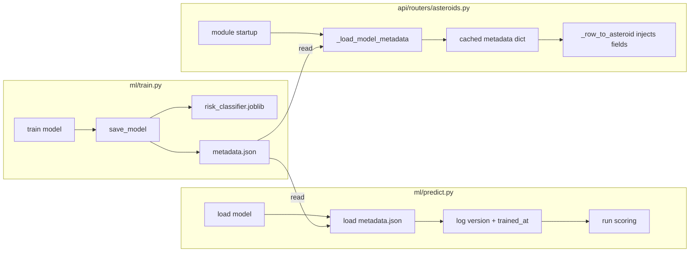

# Design Document: Model Metadata Traceability

## Overview

Este design descreve a implementação de metadados de rastreabilidade científica no pipeline de ML. O objetivo é registrar informações contextuais (versão do modelo, data de treinamento, versão do sklearn, features, intervalo de dados, amostras e acurácia) em um arquivo `metadata.json` durante o treinamento, e propagar essas informações para o pipeline de inferência e para a API REST.

A solução é composta por quatro mudanças coordenadas:
1. **Geração** — `ml/train.py` gera `metadata.json` ao salvar o modelo
2. **Logging** — `ml/predict.py` lê e loga metadados ao carregar o modelo
3. **API Response** — `api/routers/asteroids.py` injeta metadados nas respostas
4. **Teste de compatibilidade** — teste automatizado detecta incompatibilidade de versão do sklearn

### Design Decisions

| Decisão | Rationale |
|---------|-----------|
| JSON como formato de metadados | Legível por humanos, suportado nativamente pelo Python, fácil de versionar no git |
| Arquivo separado (não embutido no .joblib) | Permite leitura sem carregar o modelo inteiro; facilita inspeção manual |
| Carregamento único no startup da API | Evita I/O repetido a cada request; metadados mudam apenas com re-deploy |
| Campos opcionais na API response | Backward-compatible; clientes existentes não quebram |
| Fallback gracioso quando metadata.json ausente | Permite deploy sem re-treinar; não bloqueia inferência |

## Architecture



## Components and Interfaces

### 1. `ml/train.py` — Metadata Generation

**Mudança na assinatura de `save_model`:**

```python
def save_model(
    model: RandomForestClassifier,
    df: pd.DataFrame,
    metrics: dict
) -> None:
```

**Nova função interna `_build_metadata`:**

```python
def _build_metadata(df: pd.DataFrame, metrics: dict) -> dict:
    """Constrói o dicionário de metadados para serialização."""
    return {
        "model_version": "1.0.0",
        "trained_at": datetime.now(timezone.utc).isoformat(),
        "sklearn_version": sklearn.__version__,
        "feature_columns": FEATURE_COLUMNS,
        "training_data_range": {
            "start": str(df["feed_date"].min()),
            "end": str(df["feed_date"].max()),
        },
        "total_samples": len(df),
        "accuracy": metrics["accuracy"],
    }
```

**Serialização:** `json.dump(metadata, f, ensure_ascii=False, indent=2)` com encoding UTF-8.

### 2. `ml/predict.py` — Metadata Logging

**Nova função `_load_metadata`:**

```python
_METADATA_PATH = _ML_DIR / "models" / "metadata.json"

def _load_metadata() -> dict | None:
    """Carrega metadata.json. Retorna None se arquivo não existir."""
    if not _METADATA_PATH.exists():
        print("[WARNING] metadata.json não encontrado. Continuando sem metadados.")
        return None
    with open(_METADATA_PATH, "r", encoding="utf-8") as f:
        return json.load(f)
```

**Integração em `run_scoring`:** Após carregar o modelo, chamar `_load_metadata()` e logar `model_version` e `trained_at` via `print()`.

### 3. `api/models.py` — Response Schema

**Novos campos em `AsteroidResponse`:**

```python
model_version: Optional[str] = None
model_trained_at: Optional[str] = None
```

### 4. `api/routers/asteroids.py` — Metadata Injection

**Nova função de carregamento no nível do módulo:**

```python
import json
from pathlib import Path

_METADATA_PATH = Path("/app/ml/models/metadata.json")

def _load_model_metadata() -> dict:
    """Carrega metadata.json uma vez no startup. Retorna dict vazio se ausente."""
    if not _METADATA_PATH.exists():
        return {}
    with open(_METADATA_PATH, "r", encoding="utf-8") as f:
        return json.load(f)

_MODEL_METADATA = _load_model_metadata()
```

**Injeção em `_row_to_asteroid`:** Adicionar `model_version=_MODEL_METADATA.get("model_version")` e `model_trained_at=_MODEL_METADATA.get("trained_at")` na construção do `AsteroidResponse`.

### 5. `ml/tests/test_model_version.py` — Version Compatibility Test

```python
import warnings
import joblib
from sklearn.exceptions import InconsistentVersionWarning

def test_model_version_compatibility():
    model_path = Path(__file__).resolve().parent.parent / "models" / "risk_classifier.joblib"
    with warnings.catch_warnings(record=True) as caught:
        warnings.simplefilter("always")
        joblib.load(model_path)
    version_warnings = [w for w in caught if issubclass(w.category, InconsistentVersionWarning)]
    assert len(version_warnings) == 0, f"Incompatibilidade de versão detectada: {version_warnings[0].message}"
```

## Data Models

### metadata.json Schema

```json
{
  "model_version": "1.0.0",
  "trained_at": "2024-01-15T10:30:00+00:00",
  "sklearn_version": "1.5.2",
  "feature_columns": [
    "miss_distance_lunar",
    "relative_velocity_km_s",
    "diameter_avg_km",
    "absolute_magnitude_h",
    "is_potentially_hazardous"
  ],
  "training_data_range": {
    "start": "2024-01-01",
    "end": "2024-01-14"
  },
  "total_samples": 1523,
  "accuracy": 0.9234
}
```

### Field Specifications

| Campo | Tipo | Obrigatório | Descrição |
|-------|------|-------------|-----------|
| `model_version` | string | Sim | Versão semântica do modelo (inicialmente "1.0.0") |
| `trained_at` | string (ISO 8601) | Sim | Timestamp UTC do treinamento |
| `sklearn_version` | string | Sim | Versão do scikit-learn usada |
| `feature_columns` | array[string] | Sim | Lista ordenada de features |
| `training_data_range` | object | Sim | `{start, end}` em formato ISO date |
| `training_data_range.start` | string (ISO date) | Sim | Data mais antiga no dataset |
| `training_data_range.end` | string (ISO date) | Sim | Data mais recente no dataset |
| `total_samples` | integer | Sim | Número total de amostras de treino |
| `accuracy` | float | Sim | Acurácia do modelo no test set |

### AsteroidResponse (campos adicionados)

| Campo | Tipo | Default | Descrição |
|-------|------|---------|-----------|
| `model_version` | Optional[str] | None | Versão do modelo que gerou as predições |
| `model_trained_at` | Optional[str] | None | Data de treinamento do modelo |


## Correctness Properties

*A property is a characteristic or behavior that should hold true across all valid executions of a system — essentially, a formal statement about what the system should do. Properties serve as the bridge between human-readable specifications and machine-verifiable correctness guarantees.*

### Property 1: Metadata building preserves input-dependent fields

*For any* valid DataFrame with a `feed_date` column and any metrics dict containing an `accuracy` float, calling `_build_metadata(df, metrics)` SHALL produce a dict where:
- `training_data_range.start` equals the minimum `feed_date` in the DataFrame
- `training_data_range.end` equals the maximum `feed_date` in the DataFrame
- `total_samples` equals `len(df)`
- `accuracy` equals `metrics["accuracy"]`

**Validates: Requirements 1.6, 1.7, 1.8**

### Property 2: Metadata JSON round-trip

*For any* valid metadata dict (containing `model_version` as string, `trained_at` as ISO 8601 string, `sklearn_version` as string, `feature_columns` as list of strings, `training_data_range` as dict with `start` and `end` strings, `total_samples` as int, and `accuracy` as float), serializing to JSON with `json.dumps` and deserializing with `json.loads` SHALL produce an equivalent dict.

**Validates: Requirements 5.1, 5.2**

### Property 3: Metadata injection into API responses

*For any* asteroid row data and any loaded metadata dict containing `model_version` and `trained_at`, calling `_row_to_asteroid(row)` SHALL produce an `AsteroidResponse` where `model_version` equals `metadata["model_version"]` and `model_trained_at` equals `metadata["trained_at"]`.

**Validates: Requirements 3.4, 3.5**

## Error Handling

| Cenário | Componente | Comportamento |
|---------|-----------|---------------|
| `metadata.json` não existe | `ml/predict.py` | Log warning para stdout, retorna `None`, scoring continua normalmente |
| `metadata.json` não existe | `api/routers/asteroids.py` | `_load_model_metadata()` retorna `{}`, campos ficam `None` nas respostas |
| `metadata.json` com JSON inválido | `ml/predict.py` | `json.load` lança `JSONDecodeError` — tratar com try/except, log error, retorna `None` |
| `metadata.json` com JSON inválido | `api/routers/asteroids.py` | Tratar com try/except, retorna `{}`, campos ficam `None` |
| DataFrame sem coluna `feed_date` | `ml/train.py` | `_build_metadata` deve tratar graciosamente — usar `None` para `training_data_range` |
| Permissão de escrita negada | `ml/train.py` | Propagar exceção (mesmo comportamento do `joblib.dump` existente) |

### Fallback Strategy

O princípio geral é: **metadados são informativos, não bloqueantes**. A ausência ou corrupção do `metadata.json` nunca deve impedir a execução do scoring ou da API. Os campos simplesmente ficam `None`.

## Testing Strategy

### Unit Tests (example-based)

| Teste | Arquivo | Valida |
|-------|---------|--------|
| `test_save_model_creates_metadata_file` | `ml/tests/test_train.py` | Req 1.1 — arquivo é criado |
| `test_metadata_fixed_fields` | `ml/tests/test_train.py` | Req 1.2, 1.4, 1.5 — campos fixos corretos |
| `test_trained_at_is_iso8601_utc` | `ml/tests/test_train.py` | Req 1.3 — formato do timestamp |
| `test_save_model_signature` | `ml/tests/test_train.py` | Req 1.9 — assinatura aceita df e metrics |
| `test_load_metadata_logs_version` | `ml/tests/test_predict.py` | Req 2.2, 2.3 — logging correto |
| `test_load_metadata_missing_file_warning` | `ml/tests/test_predict.py` | Req 2.4 — fallback gracioso |
| `test_asteroid_response_optional_fields` | `api/tests/test_asteroids_router.py` | Req 3.1, 3.2 — campos opcionais |
| `test_metadata_missing_returns_none` | `api/tests/test_asteroids_router.py` | Req 3.6 — fallback na API |
| `test_model_version_compatibility` | `ml/tests/test_model_version.py` | Req 4.1, 4.2, 4.3 — compatibilidade sklearn |

### Property-Based Tests (hypothesis)

| Property | Arquivo | Min Iterations | Valida |
|----------|---------|----------------|--------|
| Property 1: Metadata building preserves input-dependent fields | `ml/tests/test_metadata_properties.py` | 100 | Req 1.6, 1.7, 1.8 |
| Property 2: Metadata JSON round-trip | `ml/tests/test_metadata_properties.py` | 100 | Req 5.1, 5.2 |
| Property 3: Metadata injection into API responses | `api/tests/test_metadata_properties.py` | 100 | Req 3.4, 3.5 |

### Property-Based Testing Configuration

- **Library**: `hypothesis` (já utilizada no projeto — ver `ml/tests/test_predict_probabilities.py`)
- **Minimum iterations**: 100 por property (`@settings(max_examples=100)`)
- **Tag format**: `Feature: model-metadata-traceability, Property {N}: {title}`
- **Marker**: `@pytest.mark.pbt`

### Test Dependencies

- `pytest` (já presente)
- `hypothesis` (já presente)
- Nenhuma dependência nova necessária
