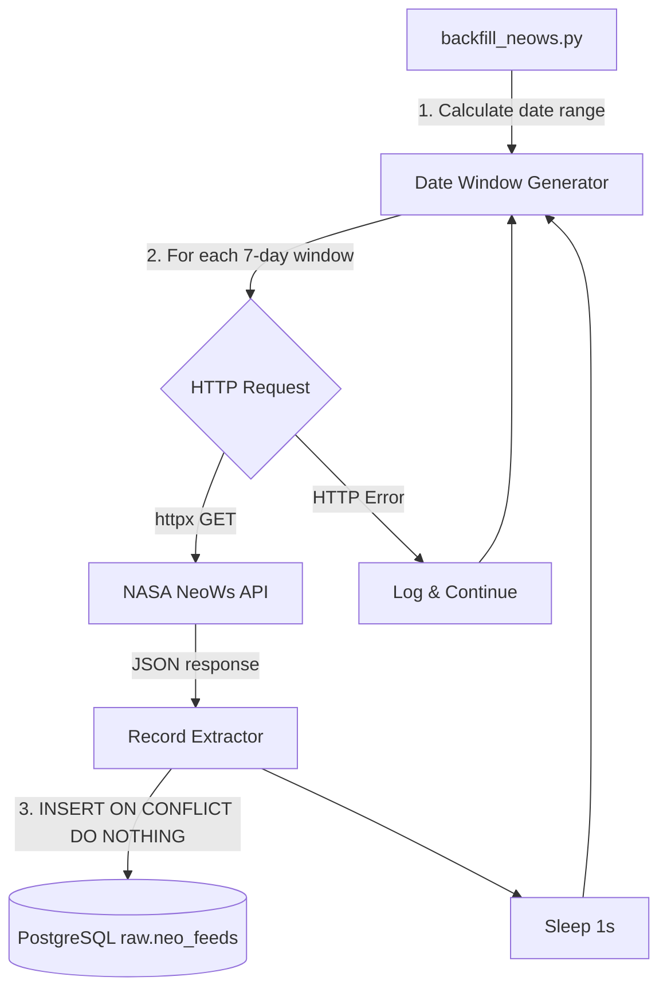

# Design Document: NeoWs Backfill Script

## Overview

A standalone Python script (`scripts/backfill_neows.py`) that backfills 12 months of historical Near-Earth Object data from NASA's NeoWs API into the `raw.neo_feeds` PostgreSQL table. The script replicates the existing collector's data insertion pattern but operates independently, iterating week-by-week over the historical range with built-in rate limiting and error resilience.

The script is designed for one-off or periodic execution to fill gaps in historical data, complementing the daily collector that only fetches the current week.

## Architecture



The architecture is intentionally simple — a single-file script with a linear execution flow:

1. **Initialization**: Read env vars, validate DATABASE_URL, set up DB engine/session
2. **Window Generation**: Calculate all 7-day windows from (today - 365) to today
3. **Processing Loop**: For each window: fetch → insert → log → sleep
4. **Summary**: Log total counts

There is no concurrency, no queue, no retry logic beyond continuing to the next window. This keeps the script simple and predictable.

## Components and Interfaces

### 1. Configuration Module (top-level constants)

```python
DATABASE_URL: str       # from os.environ["DATABASE_URL"] — required
NASA_API_KEY: str       # from os.environ.get("NASA_API_KEY", "DEMO_KEY")
NEOWS_URL: str          # "https://api.nasa.gov/neo/rest/v1/feed"
REQUEST_TIMEOUT: int    # 30 seconds
WINDOW_DAYS: int        # 7
BACKFILL_DAYS: int      # 365
RATE_LIMIT_DELAY: float # 1.0 second
```

### 2. Date Window Generator

```python
def generate_windows(start_date: date, end_date: date, step_days: int = 7) -> list[tuple[date, date]]:
    """
    Generate contiguous date windows covering [start_date, end_date].
    
    Each window spans exactly `step_days` calendar days (inclusive on both ends),
    so window_end = window_start + timedelta(days=step_days - 1).
    
    Example with step_days=7:
        window_start=2025-01-01 → window_end=2025-01-07 (7 days inclusive)
        next window_start=2025-01-08 → window_end=2025-01-14
    
    The last window is clamped: if window_start + step_days - 1 > end_date,
    then window_end = end_date (shorter final window).
    
    Returns list of (window_start, window_end) tuples.
    """
```

**Design Decision**: Extract window generation as a pure function to enable property-based testing independently of I/O concerns.

**Critical Constraint**: The NASA NeoWs API accepts a maximum span of 7 calendar days (inclusive). Since both `start_date` and `end_date` are inclusive in the API, each window must use `window_end = window_start + timedelta(days=6)` (i.e., `step_days - 1`). Using `+timedelta(days=7)` would produce an 8-day span and trigger a 400 error from the API. This matches the existing collector pattern: `end_date = start_date + timedelta(days=6)`.

### 3. NEO Record Extractor

```python
def extract_records(response_json: dict) -> list[dict]:
    """
    Transform NeoWs API response into flat list of record dicts ready for DB insertion.
    
    Each record contains: neo_id, name, raw_data (JSON string), feed_date.
    """
```

**Design Decision**: Separate data transformation from HTTP and DB concerns. This pure function maps the nested API response (`near_earth_objects` keyed by date) into a flat list of insertion parameters.

### 4. Window Processor

```python
def process_window(session, client: httpx.Client, window_start: date, window_end: date) -> tuple[int, int]:
    """
    Fetch NEO data for a single window and insert into DB.
    
    Returns (inserted_count, skipped_count).
    Raises httpx.HTTPError on request failure (caller handles).
    """
```

### 5. Main Orchestrator

```python
def run_backfill() -> None:
    """
    Main entry point. Orchestrates the full backfill:
    1. Validate config
    2. Generate windows
    3. Process each window with error handling
    4. Log summary
    """
```

### Interface with External Systems

| System | Interface | Details |
|--------|-----------|---------|
| NASA NeoWs API | HTTP GET | `start_date`, `end_date`, `api_key` query params |
| PostgreSQL | SQLAlchemy | `INSERT ... ON CONFLICT DO NOTHING` via `text()` |
| Environment | `os.environ` | `DATABASE_URL` (required), `NASA_API_KEY` (optional) |

## Data Models

### Input: NeoWs API Response Structure

```json
{
  "near_earth_objects": {
    "2024-01-15": [
      {
        "id": "3542519",
        "name": "(2010 PK9)",
        "nasa_jpl_url": "...",
        "estimated_diameter": {...},
        "close_approach_data": [...]
      }
    ]
  }
}
```

### Output: raw.neo_feeds Table

| Column | Type | Description |
|--------|------|-------------|
| id | SERIAL | Auto-increment PK |
| neo_id | VARCHAR(50) | NEO identifier from API `obj["id"]` |
| name | VARCHAR(200) | NEO name from API `obj["name"]` |
| raw_data | JSONB | Full JSON object serialized |
| ingested_at | TIMESTAMPTZ | Default NOW() |
| feed_date | DATE | Date key from `near_earth_objects` dict |

**Unique Constraint**: `(neo_id, feed_date)` — enables idempotent inserts via `ON CONFLICT DO NOTHING`.

### Internal: Window Tuple

```python
Window = tuple[date, date]  # (start_date_inclusive, end_date_inclusive)
```

## Correctness Properties

*A property is a characteristic or behavior that should hold true across all valid executions of a system — essentially, a formal statement about what the system should do. Properties serve as the bridge between human-readable specifications and machine-verifiable correctness guarantees.*

### Property 1: Window generation covers full date range with valid spans

*For any* valid start_date and end_date where start_date < end_date, the generated windows SHALL be contiguous (each window starts the day after the previous window ends), the first window SHALL start on start_date, the last window SHALL end on or before end_date, every date in [start_date, end_date] SHALL be covered by exactly one window, and each window SHALL span at most `step_days` calendar days (inclusive), i.e., `(window_end - window_start).days <= step_days - 1`. This ensures no window exceeds the NASA NeoWs API maximum of 7 days inclusive.

**Validates: Requirements 1.2, 1.3**

### Property 2: Date formatting round-trip

*For any* valid date object, formatting it as ISO 8601 (YYYY-MM-DD) and parsing it back SHALL produce the original date value.

**Validates: Requirements 2.2**

### Property 3: NEO record extraction preserves data

*For any* valid NeoWs API response containing near_earth_objects keyed by date strings, extracting records SHALL produce one record per NEO object with neo_id equal to `obj["id"]`, name equal to `obj["name"]`, raw_data equal to the JSON serialization of the full object, and feed_date equal to the date key under which the object appeared.

**Validates: Requirements 3.1**

### Property 4: All windows attempted regardless of failures

*For any* sequence of windows and any subset of those windows that produce HTTP errors, the backfill process SHALL attempt to process every window in the sequence exactly once, and the total number of attempted windows SHALL equal the total number of generated windows.

**Validates: Requirements 7.2, 7.3**

## Error Handling

| Error Scenario | Handling Strategy | Recovery |
|----------------|-------------------|----------|
| `DATABASE_URL` not set | Log error, `sys.exit(1)` | User must set env var |
| HTTP 4xx/5xx from NeoWs | Log error with window dates, continue to next window | Automatic — next window proceeds |
| Network timeout (30s) | Treated as HTTP error — log and continue | Automatic |
| JSON decode error | Treated as HTTP error — log and continue | Automatic |
| Database connection failure | Unhandled — script crashes | User must fix DB connectivity |
| Unexpected exception in window | Log error, continue to next window | Automatic |

**Design Decision**: Only `DATABASE_URL` missing causes an early exit. All per-window errors are caught and logged, allowing the script to process as many windows as possible. Database connection failures are not caught because they indicate a fundamental infrastructure problem that won't self-resolve.

## Testing Strategy

### Property-Based Tests (Hypothesis)

The project already uses Hypothesis (evidenced by `.hypothesis/` directory). Property tests will validate the pure logic components:

- **Window generation** — the core date arithmetic
- **Date formatting** — ISO 8601 round-trip
- **Record extraction** — API response transformation
- **Resilience** — all windows attempted despite failures

**Configuration**:
- Library: `hypothesis` (already in project)
- Minimum iterations: 100 per property
- Tag format: `Feature: neows-backfill, Property {N}: {description}`

### Unit Tests (pytest)

Example-based tests for specific behaviors:
- Start date calculation (today - 365)
- API call parameters (start_date, end_date, api_key, timeout=30)
- Transaction commit per window
- Rate limit delay (time.sleep(1) called between windows)
- Logging output contains expected information
- DEMO_KEY fallback when NASA_API_KEY unset
- Exit on missing DATABASE_URL

### Integration Tests

- Duplicate insert handling (ON CONFLICT DO NOTHING)
- End-to-end with mocked HTTP responses and real DB session

### Test File Location

```
scripts/tests/test_backfill_neows.py
```
