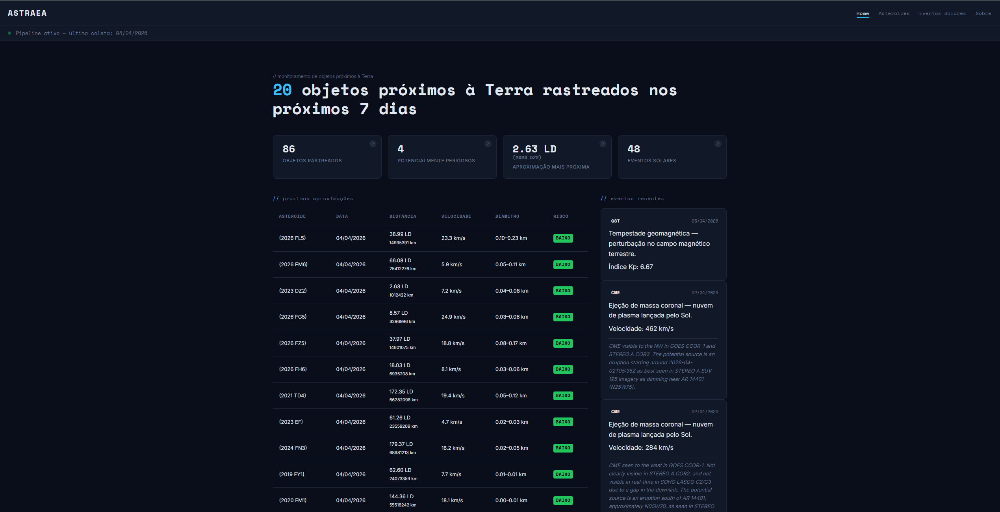

# 🌌 Astraea

> Real-time near-Earth object monitoring and solar event tracking with ML-powered risk classification.

[](https://astraea.alexarnoni.com)
[](https://astraea-api.alexarnoni.com/docs)
[](https://www.python.org/)
[](LICENSE)

---

## Overview

Astraea is an end-to-end data pipeline that ingests asteroid and solar event data from NASA APIs, transforms it with dbt, scores each object with a Random Forest classifier, and exposes everything through a public REST API and a web dashboard.

The project covers the full data engineering lifecycle — ingestion, transformation, ML inference, API serving, and frontend — running on a self-managed Oracle VM with automated daily updates.



---

## Architecture
NASA APIs (NeoWs + DONKI)
│
▼
[Collector] ──► PostgreSQL (raw)
│
▼
[dbt Core]
staging / mart layers
│
┌────────┴────────┐
▼                 ▼
[Random Forest]     [FastAPI]
(risk scoring)          │
│                 ▼
└────────► [Dashboard]

**Daily automation:** cron triggers data collection at 00:30 UTC → dbt transformations + ML scoring at 01:00 UTC.

---

## Tech Stack

| Layer | Technology |
|---|---|
| Ingestion | Python, APScheduler, NASA NeoWs + DONKI APIs |
| Storage | PostgreSQL |
| Transformation | dbt Core |
| Machine Learning | scikit-learn (RandomForestClassifier), joblib |
| API | FastAPI, slowapi (rate limiting) |
| Frontend | Vanilla JS, HTML/CSS |
| Infrastructure | Oracle VM, Nginx, Let's Encrypt, Cloudflare Pages |

---

## Live Demo

- **Dashboard:** [astraea.alexarnoni.com](https://astraea.alexarnoni.com)
- **API:** [astraea-api.alexarnoni.com/docs](https://astraea-api.alexarnoni.com/docs)

---

## API Reference

Base URL: `https://astraea-api.alexarnoni.com/v1`

Rate limit: 60 requests/minute per IP.

| Method | Endpoint | Description |
|---|---|---|
| `GET` | `/asteroids` | List asteroids with optional filters (date, risk, hazardous) |
| `GET` | `/asteroids/upcoming` | Next close approaches from today |
| `GET` | `/asteroids/{neo_id}` | Full details for a specific asteroid |
| `GET` | `/solar-events` | List solar events (CME, GST) with filters |
| `GET` | `/solar-events/earth-directed` | Earth-directed coronal mass ejections |
| `GET` | `/stats/summary` | Aggregate statistics across all collected data |
| `GET` | `/health` | API health check |

**Example response — `/v1/stats/summary`**
```json
{
  "total_asteroids": 1420,
  "hazardous_count": 312,
  "high_risk_ml": 87,
  "medium_risk_ml": 445,
  "low_risk_ml": 888,
  "total_solar_events": 203,
  "cme_count": 178,
  "gst_count": 25,
  "closest_approach_lunar": 1.23,
  "closest_asteroid_name": "(2024 BX1)"
}
```

---

## ML Risk Model

A **Random Forest classifier** trained on historical close approach data scores each asteroid into three risk levels: `low`, `medium`, or `high`.

**Features used:**

| Feature | Description |
|---|---|
| `miss_distance_lunar` | Miss distance in lunar units |
| `relative_velocity_km_s` | Relative velocity in km/s |
| `diameter_avg_km` | Estimated average diameter in km |
| `absolute_magnitude_h` | Absolute magnitude (H) |
| `is_potentially_hazardous` | NASA potentially hazardous object flag |
| `orbit_class` | Orbital classification group |
| `is_sentry_object` | Listed on NASA Sentry impact monitoring system |

The trained model (`risk_classifier.joblib`) is applied in batch daily via `ml/predict.py`, updating `risk_score_ml` and `risk_label_ml` in the mart layer.

---

## Database Schema
raw.neo_feeds              — raw asteroid data (JSONB)
raw.solar_events           — raw solar event data (JSONB)
staging.stg_asteroids      — normalized asteroids
staging.stg_solar_events   — normalized solar events
mart.mart_asteroids        — enriched asteroids with ML risk scores
mart.mart_solar_events     — enriched solar events

---

## Local Development

### Prerequisites

- Docker and Docker Compose
- Python 3.11+
- dbt Core
- NASA API key — get one free at [api.nasa.gov](https://api.nasa.gov/)

### Setup
```bash
git clone https://github.com/alexarnoni/astraea.git
cd astraea

cp .env.example .env
# Fill in your credentials in .env
```
```env
POSTGRES_USER=astraea
POSTGRES_PASSWORD=your_password
POSTGRES_DB=astraea
DATABASE_URL=postgresql://astraea:your_password@db:5432/astraea
NASA_API_KEY=your_nasa_api_key
```

### Run
```bash
# Start PostgreSQL, collector and API
docker-compose up --build

# Run dbt transformations
cd dbt/astraea
dbt run
dbt test

# Train the ML model (run from WSL2 on Windows)
python ml/train.py

# Run batch scoring
python ml/predict.py
```

> **Windows users:** run ML scripts from WSL2 with `DATABASE_URL` set as an environment variable. `psycopg2` has encoding issues on native Windows (CP1252).

### Tests
```bash
# API (includes rate limiting tests)
cd api
pip install -r requirements.txt
python -m pytest tests/ -v

# ML
cd ml
pytest tests/
```

---

## Project Structure
astraea/
├── collector/          # Data ingestion (NeoWs + DONKI)
├── dbt/astraea/        # dbt models: staging + mart layers
├── ml/                 # Model training, scoring, and tests
├── api/                # FastAPI application and endpoints
├── dashboard/          # Vanilla JS frontend
├── scripts/            # Database initialization SQL
├── notebooks/          # Exploratory analysis
├── docs/               # Assets (screenshots, diagrams)
├── docker-compose.yml
└── .env.example

---

## Roadmap

| Version | Focus |
|---|---|
| **v1.1** | SSL auto-renewal, rate limiting, solar event detail page, date filters |
| **v1.2** | 12-month backfill (~5,000 objects), automated ML retraining, GitHub Actions |
| **v1.3** | Historical dashboard with Chart.js, full orbital data, multi-pass comparison |
| **v1.4** | 2D orbit visualization (D3.js), email alerts for high-risk events |
| **v3.0** | Airflow migration, ESA NEO + Minor Planet Center integration |

---

## Data Sources

- [NASA NeoWs](https://api.nasa.gov/neo/rest/v1/feed) — Near Earth Object Web Service
- [NASA DONKI](https://api.nasa.gov/DONKI/) — Space Weather Database Of Notifications, Knowledge, Information

---

## License

MIT
